# Manual Operacional e Técnico do Sistema — Comitê Digital

> **Guia Completo de Arquitetura, Engenharia e Processos com Diagramas Mermaid**  
> *Versão de Referência — Comitê Digital SaaS Multi-organização*

---

## Sumário

1. [Visão Geral e Macroprocesso Integrado](#1-visão-geral-e-macroprocesso-integrado)
2. [Processo 1: Autenticação, Controle de Acesso e Governança Multi-Tenant](#2-processo-1-autenticação-controle-de-acesso-e-governança-multi-tenant)
3. [Processo 2: Cadastro de Pessoas e Onboarding Descentralizado (Link Público)](#3-processo-2-cadastro-de-pessoas-e-onboarding-descentralizado-link-público)
4. [Processo 3: Recepção, Validação Síncrona e Versionamento de Documentos](#4-processo-3-recepção-validação-síncrona-e-versionamento-de-documentos)
5. [Processo 4: Ciclo de Vida do Contrato (Máquina de Estados e Emissão Formal)](#5-processo-4-ciclo-de-vida-do-contrato-máquina-de-estados-e-emissão-formal)
6. [Processo 5: Operação de Campo, Mobilidade e Capacidade Offline (PWA)](#6-processo-5-operação-de-campo-mobilidade-e-capacidade-offline-pwa)
7. [Processo 6: Monitoramento Executivo em Tempo Real e Detalhamento Progressivo](#7-processo-6-monitoramento-executivo-em-tempo-real-e-detalhamento-progressivo)
8. [Processo 7: Motor de Mensageria, Idempotência e Automações Periódicas (pg_cron)](#8-processo-7-motor-de-mensageria-idempotência-e-automações-periódicas-pg_cron)
9. [Processo 8: Trilha de Auditoria, Segurança e Conformidade com a LGPD](#9-processo-8-trilha-de-auditoria-segurança-e-conformidade-com-a-lgpd)
10. [Modelo Entidade-Relacionamento do Banco de Dados](#10-modelo-entidade-relacionamento-do-banco-de-dados)

---

## 1. Visão Geral e Macroprocesso Integrado

O **Comitê Digital** é uma plataforma concebida para estruturar e automatizar integralmente o ciclo de gestão de mão de obra temporária. A espinha dorsal do sistema conecta quatro fases sequenciais:

1. **Captação Cadastral & Documental:** Coleta de dados e anexos de identificação (RG, CNH, dados bancários e endereço) sem atrito para o contratado.
2. **Triagem Técnica & Qualificação:** Verificação síncrona de resolução, unicidade criptográfica e aprovação de aptidão.
3. **Formalização Jurídica:** Geração paramétrica de contratos com cálculos monetários por extenso e controle rigoroso de assinatura e distrato.
4. **Governança & Acompanhamento:** Painel consolidado em tempo real com detalhamento progressivo em até dois cliques e exportações oficiais.

### Diagrama do Macroprocesso Operacional

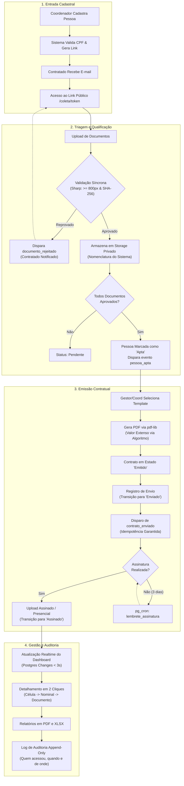

---

## 2. Processo 1: Autenticação, Controle de Acesso e Governança Multi-Tenant

O modelo de segurança do Comitê Digital baseia-se no princípio do menor privilégio e isolamento absoluto entre organizações (*tenants*) e regiões administrativas.

### Mecânica de Funcionamento

1. **Solicitação de Acesso:** O usuário informa seu e-mail corporativo em `/login`. O sistema dispara um link mágico via Supabase Auth.
2. **Segundo Fator Obrigatório (MFA TOTP):** Para perfis executivos (`gestor` e `coord_comite`), o sistema exige autenticação em dois fatores (`aal2`). Usuários sem fator cadastrado são direcionados ao pareamento via QR Code em `/mfa`.
3. **Injeção de Claims no JWT:** Um *Custom Access Token Hook* no PostgreSQL intercepta a emissão do token e injeta as variáveis `organizacao_id`, `papel` e `regiao_id` nas claims do token JWT.
4. **Enforcement por Row Level Security (RLS):** Cada consulta no banco de dados é filtrada diretamente pelo PostgreSQL via funções de suporte estáveis: `(select public.organizacao_id())`, `(select public.papel())` e `(select public.regiao_id())`.
5. **Enclausuramento da Chave Mestra:** A `SUPABASE_SERVICE_ROLE_KEY` é estritamente proibida no caminho de requisições de usuários, sendo enclausurada em `src/lib/supabase/admin.ts` com proteção ativa por linter (`no-restricted-imports`).

### Diagrama de Sequência: Autenticação e Autorização RLS

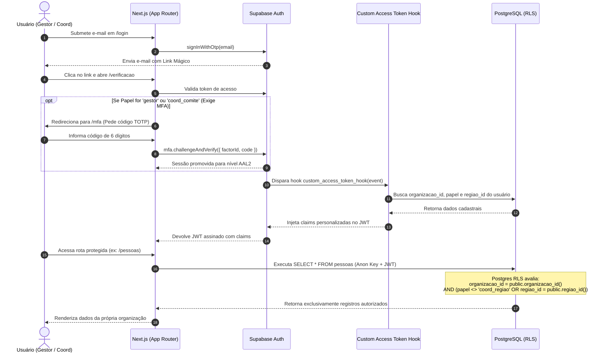

---

## 3. Processo 2: Cadastro de Pessoas e Onboarding Descentralizado (Link Público)

O cadastro de prestadores e militantes evita gargalos operacionais ao descentralizar o preenchimento de dados e o envio de documentos.

### Mecânica de Funcionamento

1. **Início do Cadastro:** O coordenador registra os dados biográficos preliminares da pessoa (Nome, CPF, Função e Região).
2. **Validação Estrita de CPF:** O sistema valida os dois dígitos verificadores matemáticos do CPF e verifica se já existe registro com aquele documento na mesma organização. Em caso de colisão, impede o cadastro duplo e aponta o registro já existente.
3. **Geração do Link Público:** É criado um registro na tabela `links_coleta` com token pseudo-aleatório criptograficamente seguro e data de expiração programada.
4. **Disparo do Link:** O sistema enfileira a notificação `link_coleta` via Resend, contendo o link `/coleta/[token]`.
5. **Preenchimento sem Senha:** O titular acessa a página pública no celular, confere seus dados e realiza a submissão dos comprovantes sem necessidade de criar conta no sistema.

### Diagrama de Sequência: Geração e Consumo do Link de Coleta

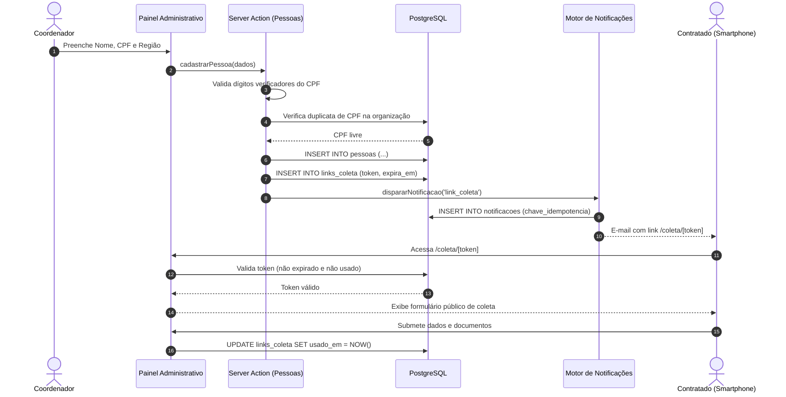

---

## 4. Processo 3: Recepção, Validação Síncrona e Versionamento de Documentos

A integridade do repositório documental é mantida por meio de um filtro síncrono imposto na borda de recepção dos arquivos.

### Critérios Técnicos de Aceitação

* **Resolução Mínima:** Imagens (JPEG/PNG) precisam ter ao menos **800 pixels** na menor dimensão. Imagens menores (como miniaturas de 72×72 px) são recusadas imediatamente com instruções de reenvio.
* **Detecção de Duplicatas:** O arquivo tem sua soma criptográfica **SHA-256** calculada. Se o hash já constar no banco daquela organização, o upload é bloqueado, evitando duplicatas desnecessárias.
* **Nomenclatura do Sistema:** O nome original do arquivo é gravado como metadado. O caminho físico no bucket segue o formato `{organizacao_id}/{tipo}_{pessoa_id}_v{versao}.{ext}`.
* **Versionamento:** O reenvio de um documento reprovado não sobrescreve o anterior: cria uma nova linha com `versao = versao + 1`.
* **Qualificação Automática (Aptidão):** Quando todos os documentos obrigatórios exigidos para a função estão no estado `aprovado`, a pessoa é automaticamente atualizada para `apta = true`, disparando a notificação `pessoa_apta` para o coordenador.

### Diagrama de Fluxo de Decisão: Upload e Validação de Documentos

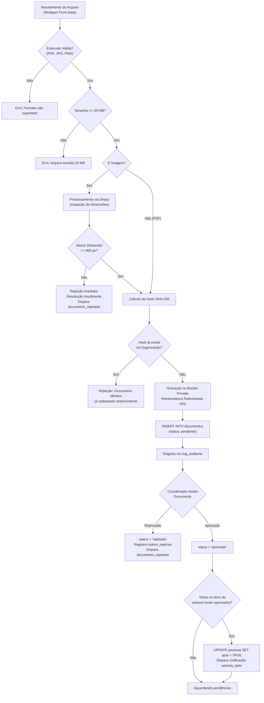

---

## 5. Processo 4: Ciclo de Vida do Contrato (Máquina de Estados e Emissão Formal)

O gerenciamento de contratos é blindado por um autômato finito estrito, implementado na aplicação em TypeScript e replicado em nível de banco de dados via função RPC no PostgreSQL.

### A Máquina de Estados Contratual

As transições permitidas entre os estados do contrato são:

* `rascunho` $\rightarrow$ `emitido` ou `cancelado`
* `emitido` $\rightarrow$ `enviado` ou `cancelado`
* `enviado` $\rightarrow$ `assinado` ou `cancelado`
* `assinado` $\rightarrow$ `distratado` ou `encerrado`
* `distratado` $\rightarrow$ `distrato_assinado`
* Estados terminais: `distrato_assinado`, `encerrado`, `cancelado`

### Diagrama de Estados do Contrato

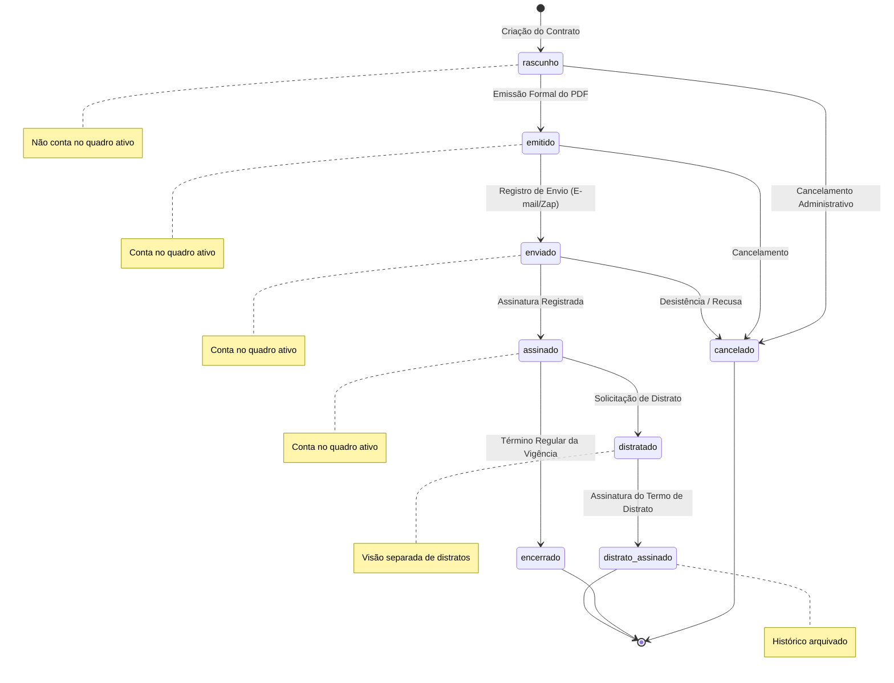

### Emissão e Compilação de PDF

1. **Mescla com Template:** Os marcadores `{{nome}}`, `{{cpf}}`, `{{endereco}}`, `{{objeto}}`, `{{vigencia_inicio}}` e `{{vigencia_fim}}` são substituídos pelas informações do contratado.
2. **Cálculo de Extenso Gramatical:** O valor numérico passa pela biblioteca `extenso`, gerando a redação legal em reais de forma infalível (ex.: `R$ 3.553,00` $\rightarrow$ `"três mil quinhentos e cinquenta e três reais"`).
3. **Renderização Vetorial:** O PDF institucional é compilado diretamente no servidor via `pdf-lib` e persistido no bucket `contratos`.
4. **Transação Atômica:** A mudança de estado para `emitido` e a inserção em `eventos_contrato` ocorrem na mesma transação. Se uma falhar, toda a operação sofre rollback.

### Diagrama de Sequência: Emissão e Assinatura com Transação Atômica

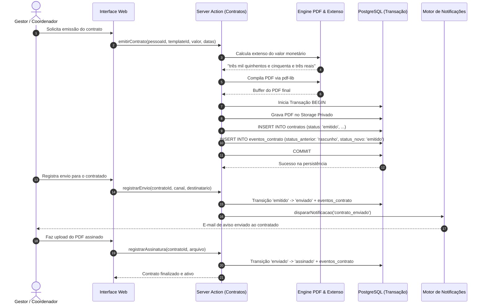

---

## 6. Processo 5: Operação de Campo, Mobilidade e Capacidade Offline (PWA)

A rotina de campo foi desenhada para condições adversas: conexões oscilantes, aparelhos simples e uso sob movimento.

### Princípios da Operação Mobile

* **Viewport de 360 px:** Toda a interface de campo funciona em telas compactas, com botões de toque generosos dimensionados para o uso com uma só mão.
* **Regra dos 3 Toques:** A partir da tela inicial do PWA, o apontamento de atividade (ex.: panfletagem, montagem de estrutura, comício) é concluído em no máximo 3 interações.
* **Fila Local no IndexedDB:** Na ausência de sinal de internet, os registros não são perdidos: são serializados no banco local do navegador.
* **Sincronização com Indicador Honesto:** Um banner transparente informa a quantidade de itens na fila pendente. Ao detectar reconexão (`navigator.onLine`), o sistema processa a fila sequencialmente contra o servidor.

### Diagrama de Fluxo: Operação Offline e Sincronização de Campo

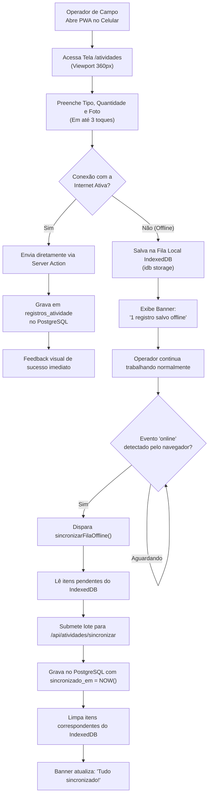

---

## 7. Processo 6: Monitoramento Executivo em Tempo Real e Detalhamento Progressivo

O gestor e os coordenadores acompanham a evolução da equipe por um painel em tempo real sem necessidade de recarregar a página manualmente.

### Arquitetura do Dashboard

* **Canal Realtime Resiliente:** Uma assinatura única de WebSocket monitora as tabelas `contratos`, `pessoas`, `documentos` e `notificacoes`.
* **Degradação Graciosa:** Se a conexão de WebSocket oscilar ou fechar (`CHANNEL_ERROR` ou `TIMED_OUT`), o sistema ativa um polling inteligente automático a cada 5 segundos até que a conexão Realtime se restabeleça.
* **Detalhamento Progressivo (*Drill-Down* em 2 Cliques):**
  * *1º Clique:* Em qualquer número do painel (matriz, funil ou card regional), abre-se um modal com a lista nominal correspondente.
  * *2º Clique:* Clicando sobre o nome da pessoa no modal, o sistema gera uma URL assinada e abre o documento comprobatório ou o PDF do contrato numa nova aba.
* **Tratamento de Lacunas de Dados:** Regiões sem dados preenchidos (como o caso real de Taguatinga com contratos sem assinatura informada) exibem o rótulo explícito **"não informado"**, evitando inflar métricas com zeros falsos.

### Diagrama de Sequência: Atualização Realtime e Drill-Down Progressivo

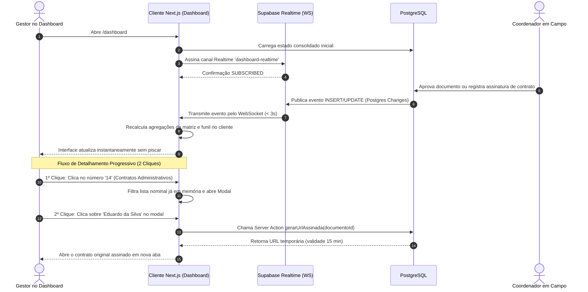

---

## 8. Processo 7: Motor de Mensageria, Idempotência e Automações Periódicas (pg_cron)

O sistema conta com um motor de automação que antecipa pendências operacionais e elimina a necessidade de cobranças manuais.

### Garantias de Entrega e Idempotência

1. **Chaves Determinísticas:** Antes de solicitar o envio de qualquer e-mail pelo Resend, o sistema grava uma linha na tabela `notificacoes` com uma chave determinística única (ex.: `contrato_enviado:{contrato_id}` ou `vigencia_a_vencer:{contrato_id}:7d`).
2. **Proteção contra Duplicatas:** Se o agendador rodar repetidas vezes no mesmo dia, o índice único do banco recusa a inserção da chave repetida, impedindo disparos múltiplos para o mesmo evento.
3. **Resiliência a Falhas do Provedor:** A falha no serviço de e-mail nunca cancela a transação principal de negócio: o contrato permanece emitido/enviado, e a notificação é marcada como `falhou`, sendo capturada pela rotina de reprocessamento.
4. **Agendamento com `pg_cron` e Segurança via `CRON_SECRET`:** As rotas de cron em `/api/cron/*` só podem ser disparadas mediante o envio do cabeçalho `Authorization: Bearer <CRON_SECRET>`, protegendo as rotinas contra execuções não autorizadas.

### As Quatro Automações do Sistema

| Job Agendado | Frequência | Objetivo Operacional |
|---|---|---|
| **Vigências a Vencer** | Diariamente às 07:00 | Alerta gestores sobre contratos que expirarão em 7 ou 3 dias |
| **Lembrete de Assinatura** | Diariamente às 07:30 | Cobra contratados com contratos em `enviado` há mais de 3 dias |
| **Resumo Diário** | Dias úteis às 08:00 (Brasília) | Envia ao gestor um balanço das últimas 24h e lista de pendências |
| **Reprocessamento** | A cada 15 minutos | Retenta notificações `falhou` com recuo exponencial (máx. 3 vezes) |

### Diagrama de Sequência: Automações Periódicas com pg_cron

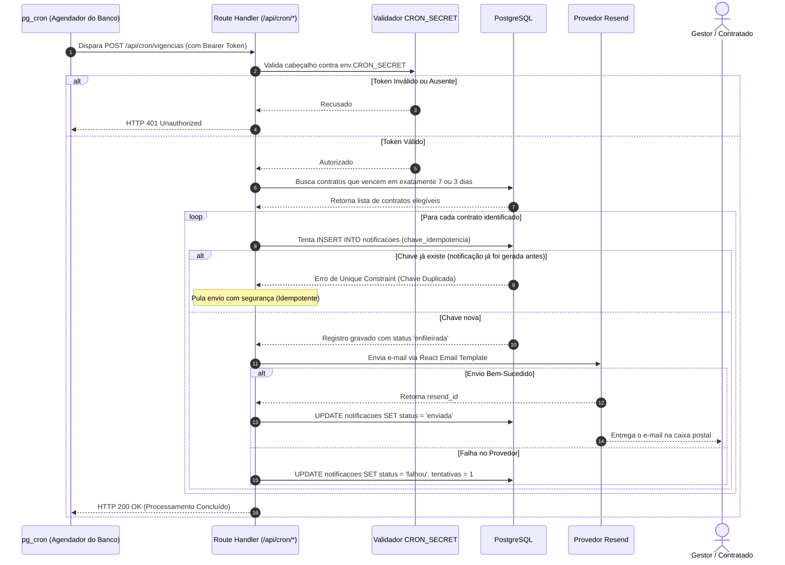

---

## 9. Processo 8: Trilha de Auditoria, Segurança e Conformidade com a LGPD

A integridade do acervo é assegurada por mecanismos de proteção e rastreabilidade que atendem aos preceitos da Lei Geral de Proteção de Dados (LGPD).

### Medidas de Blindagem

* **Isolamento Criptográfico em Buckets Privados:** Nenhum anexo repousa em links públicos estáticos. Todos os buckets de documentos e contratos são estritamente privados. O acesso só ocorre por URLs assinadas pelo servidor, com validade máxima de 15 minutos.
* **Tabelas Somente-Inserção (*Append-Only*):** As tabelas `log_auditoria` e `eventos_contrato` não possuem políticas de `UPDATE` ou `DELETE` no RLS. Uma vez gravado, o evento torna-se imutável.
* **Rastreabilidade de Visualização:** Toda chamada à função `criarUrlAssinada` registra um evento no `log_auditoria`, registrando o usuário solicitante, a pessoa consultada, o endereço IP e o timestamp da operação.
* **Minimização de Dados Sensíveis:** Comunicações transacionais (e-mails e logs do sistema) são terminantemente proibidas de exibir dados como CPF, RG, endereço, chave PIX ou valor contratual no corpo da mensagem. O e-mail serve exclusivamente como gatilho de redirecionamento para o ambiente seguro.

### Diagrama de Fluxo: Acesso Seguro e Trilha de Auditoria

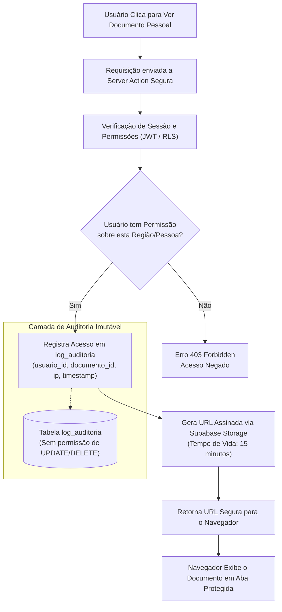

---

## 10. Modelo Entidade-Relacionamento do Banco de Dados

Abaixo está o diagrama formal das entidades, tipos enumerados e relacionamentos que compõem o banco de dados relacional do Comitê Digital:

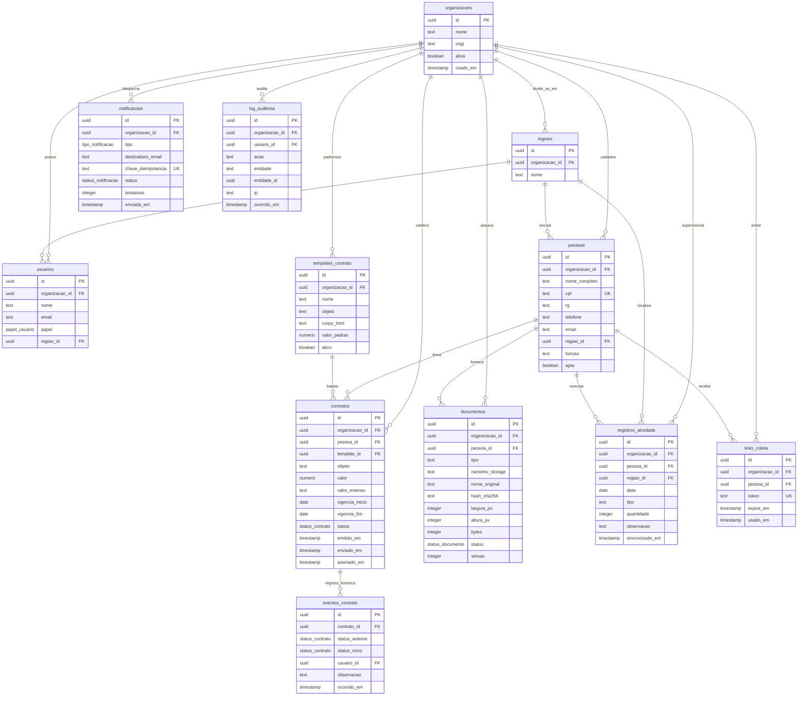

---

## Conclusão

Este manual documenta o ecossistema integrado do **Comitê Digital**. Ao articular validações preventivas na entrada de dados, persistência relacional com garantia transacional, controle de concorrência por RLS e atualizações reativas em tempo real, o sistema garante conformidade jurídica integral, governança de ponta a ponta e eficiência operacional para equipes temporárias.
