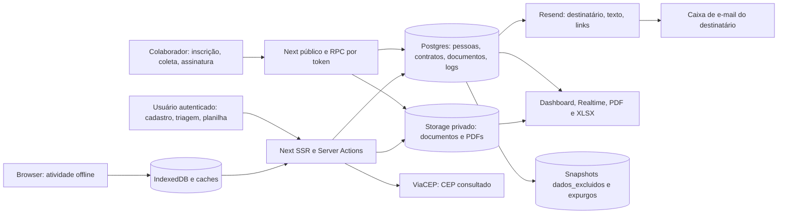

# Auditoria de Segurança — Comitê Digital

## Fase 1 — Inventário e mapa da superfície de ataque

Data: 10/09/2026. Referência Git: `5b6c2967bf5af65c6054373523ff613820c490a1`.

Esta entrega cumpre somente a Fase 1 do roteiro fornecido. É um inventário estático, sem classificação de vulnerabilidades, parecer de segurança para produção ou correções. A Fase 2 depende da revisão desta entrega, conforme a instrução: “Execute em três fases, parando ao final de cada uma para eu revisar antes de seguir”.

Foram lidos arquivos locais e extraídas declarações de código/configuração. Não foram feitas requisições à aplicação, ao Supabase ou ao Resend, consultas ao banco, scans, builds ou execução de testes. Resultados de trabalhos anteriores e afirmações de segurança do README não foram usados como comprovação de comportamento nesta auditoria. Nenhum código da aplicação foi alterado; os únicos arquivos entregues são este relatório e seus inventários auxiliares.

**Cobertura declarada no repositório:** 18 páginas, 13 caminhos de API com 17 métodos explícitos, 32 Server Actions, 14 tabelas de negócio, uma view, 29 policies nessas tabelas e cinco em Storage. As migrations contêm 23 assinaturas de funções após considerar substituições e remoções em ordem de nome de arquivo; 11 usam `SECURITY DEFINER`. A presença simultânea das duas sobrecargas de busca depende da ordem realmente aplicada. Nenhuma implementação de Edge Function foi encontrada.

Arquivos auxiliares:

- [Policies completas, com origem e linha](AUDITORIA-SEGURANCA-FASE-1-POLICIES.md).
- [Dependências diretas e transitivas do lockfile](AUDITORIA-SEGURANCA-FASE-1-DEPENDENCIAS.csv).
- [Ocorrências das variáveis de ambiente](AUDITORIA-SEGURANCA-FASE-1-AMBIENTE.csv).

## 1. Estrutura, stack e fronteiras

```text
src/
├── app/
│   ├── (auth)/          login, troca de senha e MFA/TOTP
│   ├── (painel)/        dashboard, pessoas, contratos, documentos e configurações
│   ├── inscricao/       entrada pública por slug da campanha
│   ├── coleta/          formulário público por token individual
│   ├── assinar/         leitura e assinatura pública por token de contrato
│   ├── api/             handlers de upload, assinatura, acesso, cron e webhook
│   ├── offline/         fallback do PWA
│   └── manifest.ts      manifesto do PWA
├── components/          formulários, câmera/OCR, visualizadores e componentes visuais
├── lib/
│   ├── supabase/        clientes browser, SSR e service_role; leitura de claims
│   ├── contratos/       PDF, modelos, transições, distrato e evidências
│   ├── documentos/     validação de upload, CPF, signed URLs e retenção
│   ├── notificacoes/    transporte Resend, persistência, retry e webhook
│   ├── cron/            autenticação, seleção e execução dos jobs
│   ├── atividades/      IndexedDB e sincronização da fila offline
│   ├── auditoria/       gravação de acessos e mutações
│   ├── dashboard/       agregações e exportação PDF/XLSX
│   └── auth,cep,pessoas,inscricao,equipe,organizacao,regioes,coleta/
│                        validações e serviços dos respectivos domínios
├── db/                  schema Drizzle, acesso SQL, seeds e administração de usuários
└── emails/              sete modelos de e-mail transacional
supabase/
├── config.toml          configuração de desenvolvimento local dos serviços
├── migrations/          DDL, RLS, RPCs, grants, triggers e cron; meta/ do Drizzle
└── functions/.gitkeep   diretório sem implementação de Edge Function
public/                  service worker, ícones e SVGs estáticos
scripts/                 aplicação manual de SQL em transação
tests/                   testes unitários, integração e E2E; não executados na auditoria
docs/                    documentação de design/contratos e esta auditoria
.agents/, .codex/        instruções/ferramentas de desenvolvimento; não são endpoints
```

O README descreve uma organização por campanha/comitê, dentro de um projeto Supabase compartilhado, com administração central por `superadmin`. O código usa `organizacao_id` nas linhas e claims `organizacao_id`, `papel`, `regiao_id` no JWT. Os papéis declarados são `gestor`, `coord_comite`, `coord_regiao`, `contratado`, `auditor` e `superadmin`.

Fontes: [README.md](</home/waldo/Projetos/ComiteDigital/README.md>), [supabase/migrations/0000_common_dakota_north.sql:6](</home/waldo/Projetos/ComiteDigital/supabase/migrations/0000_common_dakota_north.sql:6>), [supabase/migrations/0023_papel_superadmin.sql:4](</home/waldo/Projetos/ComiteDigital/supabase/migrations/0023_papel_superadmin.sql:4>), [supabase/migrations/0016_gestao_acessos.sql:86](</home/waldo/Projetos/ComiteDigital/supabase/migrations/0016_gestao_acessos.sql:86>).

As permissões efetivas não são inferidas desses nomes de papel. Por exemplo, a regra regional é uma condição específica para `coord_regiao`; cada tabela e ação abaixo registra seu próprio predicado. As exceções de `superadmin` estão explícitas nas policies de `organizacoes` e `usuarios` e em handlers administrativos; não se presume acesso global às outras tabelas.

A stack resolvida no lockfile inclui Next.js 15.5.25, React 19.1.0, Supabase JS 2.116.0, SSR 0.12.6, Drizzle ORM 0.45.2, Resend 6.26.0 e Postgres local major 17 no TOML. A versão do servidor Postgres publicado não foi consultada. Não há manifesto versionado de Vercel/Netlify, Docker ou pipeline CI entre os caminhos examinados (`vercel.json`, `netlify.toml`, `Dockerfile`, `compose.yml`, `docker-compose.yml`, `.github`, `.gitlab-ci.yml`). O host e o repositório remoto de produção não são determináveis pelo README e esses arquivos. O SVG `public/vercel.svg` não comprova hospedagem.

| Fronteira | Cliente/credencial declarada | Evidência |
| --- | --- | --- |
| Browser → Supabase Auth/Realtime | Chave pública e sessão do usuário | [src/lib/supabase/client.ts:13](</home/waldo/Projetos/ComiteDigital/src/lib/supabase/client.ts:13>) |
| Next SSR/Actions → PostgREST/Storage | Chave pública + cookies/JWT do usuário | [src/lib/supabase/server.ts:12](</home/waldo/Projetos/ComiteDigital/src/lib/supabase/server.ts:12>) |
| APIs administrativas, assinatura pública, cron/webhook → Supabase | service_role, sem persistir sessão; restrições precisam estar no chamador | [src/lib/supabase/admin.ts:23](</home/waldo/Projetos/ComiteDigital/src/lib/supabase/admin.ts:23>) |
| Scripts/Drizzle → Postgres | DATABASE_URL; acesso fora dos handlers do painel | [src/db/client.ts:15](</home/waldo/Projetos/ComiteDigital/src/db/client.ts:15>), [scripts/aplicar-sql.mjs:23](</home/waldo/Projetos/ComiteDigital/scripts/aplicar-sql.mjs:23>) |
| Postgres → Next cron | pg_net; Bearer lido do Vault | [supabase/migrations/0011_pg_cron_jobs.sql:51](</home/waldo/Projetos/ComiteDigital/supabase/migrations/0011_pg_cron_jobs.sql:51>) |

## 2. Rotas e endpoints

### 2.1 Regra comum de entrada

`src/middleware.ts:48` trata todos os `/api/*` como públicos para fins de redirecionamento: a autenticação de cada API é responsabilidade de seu handler. O painel exige claims de sessão e redireciona a `/login` quando faltam; não há gate comum de papel. A flag `app_metadata.must_change_password` redireciona para `/definir-senha`, com exceções para APIs, login e recursos PWA. As listas de caminhos públicos usam `startsWith`. Evidência:

```ts
// src/middleware.ts:51 e :85
pathname.startsWith("/api/")
if (!autenticado && !ehRotaPublica(pathname)) {
  const url = request.nextUrl.clone();
  url.pathname = "/login";
  return NextResponse.redirect(url);
}
```

Nas tabelas, “sessão + RLS” indica cliente do usuário, sem restrição adicional de papel naquele handler. Isso não concede autorização por si só: aplicam-se os predicados da seção 3. A sessão do Supabase sem claims de organização não equivale a acesso aos dados do painel.

### 2.2 Páginas

| Caminho | Método | Autenticação | Papel | Função / fonte |
| --- | --- | --- | --- | --- |
| / | GET | Pública | Nenhum | Landing institucional — [src/app/page.tsx:65](</home/waldo/Projetos/ComiteDigital/src/app/page.tsx:65>) |
| /assinar/[token] | GET | Sem login; token validado por RPC | Nenhum | Contrato, desenho de assinatura e foto — [src/app/assinar/[token]/page.tsx:28](</home/waldo/Projetos/ComiteDigital/src/app/assinar/[token]/page.tsx:28>) |
| /atividades | GET | Sessão pelo middleware | Sem gate adicional | Redireciona /configuracoes?aba=atividades — [src/app/(painel)/atividades/page.tsx:5](</home/waldo/Projetos/ComiteDigital/src/app/(painel)/atividades/page.tsx:5>) |
| /coleta/[token] | GET | Sem login; token validado por RPC | Nenhum | Dados complementares e upload — [src/app/coleta/[token]/page.tsx:23](</home/waldo/Projetos/ComiteDigital/src/app/coleta/[token]/page.tsx:23>) |
| /configuracoes | GET | Sessão + RLS | Sem gate comum; campanhas globais somente se superadmin | Modelos, identidade, membros, regiões e atividades — [src/app/(painel)/configuracoes/page.tsx:16](</home/waldo/Projetos/ComiteDigital/src/app/(painel)/configuracoes/page.tsx:16>) |
| /contratos | GET | Sessão + RLS | Sem gate adicional de papel para abrir | Listagem paginada; mutações têm gates próprios — [src/app/(painel)/contratos/page.tsx:4](</home/waldo/Projetos/ComiteDigital/src/app/(painel)/contratos/page.tsx:4>) |
| /dashboard | GET | Sessão + RLS | Sem gate adicional de papel | Resumo e base nominal — [src/app/(painel)/dashboard/page.tsx:9](</home/waldo/Projetos/ComiteDigital/src/app/(painel)/dashboard/page.tsx:9>) |
| /dashboard/contratos | GET | Sessão + RLS | Sem gate adicional de papel | Detalhamento do funil por pessoa/objeto — [src/app/(painel)/dashboard/contratos/page.tsx:4](</home/waldo/Projetos/ComiteDigital/src/app/(painel)/dashboard/contratos/page.tsx:4>) |
| /definir-senha | GET | Sessão pelo middleware | Qualquer usuário autenticado | Troca via POST /api/conta/senha — [src/app/(auth)/definir-senha/page.tsx:10](</home/waldo/Projetos/ComiteDigital/src/app/(auth)/definir-senha/page.tsx:10>) |
| /documentos | GET | Sessão + RLS | Sem gate adicional de papel para abrir | Triagem; aprovar/rejeitar exige gestor/coord_comite — [src/app/(painel)/documentos/page.tsx:12](</home/waldo/Projetos/ComiteDigital/src/app/(painel)/documentos/page.tsx:12>) |
| /equipe | GET | Sessão pelo middleware | Sem gate adicional | Redireciona /configuracoes?aba=equipe — [src/app/(painel)/equipe/page.tsx:5](</home/waldo/Projetos/ComiteDigital/src/app/(painel)/equipe/page.tsx:5>) |
| /inscricao/[slug] | GET | Sem login; slug de organização ativa via RPC | Nenhum | Inscrição e obtenção de token de coleta — [src/app/inscricao/[slug]/page.tsx:18](</home/waldo/Projetos/ComiteDigital/src/app/inscricao/[slug]/page.tsx:18>) |
| /login | GET | Pública | Nenhum | Login com e-mail/senha diretamente no Supabase Auth — [src/app/(auth)/login/page.tsx:9](</home/waldo/Projetos/ComiteDigital/src/app/(auth)/login/page.tsx:9>) |
| /mfa | GET | Casca pública; fluxo depende de sessão no browser | Nenhum papel específico | getSession; cadastro/desafio/verificação TOTP — [src/app/(auth)/mfa/page.tsx:16](</home/waldo/Projetos/ComiteDigital/src/app/(auth)/mfa/page.tsx:16>) |
| /offline | GET | Pública | Nenhum | Fallback de rede — [src/app/offline/page.tsx:7](</home/waldo/Projetos/ComiteDigital/src/app/offline/page.tsx:7>) |
| /pessoas | GET | Sessão + RLS | Sem gate adicional de papel | Lista cadastral/demográfica — [src/app/(painel)/pessoas/page.tsx:11](</home/waldo/Projetos/ComiteDigital/src/app/(painel)/pessoas/page.tsx:11>) |
| /pessoas/importar | GET | Sessão pelo middleware | Sem gate adicional de papel | Conferência e importação de planilha — [src/app/(painel)/pessoas/importar/page.tsx:9](</home/waldo/Projetos/ComiteDigital/src/app/(painel)/pessoas/importar/page.tsx:9>) |
| /regioes | GET | Sessão pelo middleware | Sem gate adicional | Redireciona /configuracoes?aba=regioes — [src/app/(painel)/regioes/page.tsx:5](</home/waldo/Projetos/ComiteDigital/src/app/(painel)/regioes/page.tsx:5>) |

Também há `GET /manifest.webmanifest` (`src/app/manifest.ts:9`), `GET /favicon.ico` (`src/app/favicon.ico`), `GET /sw.js`, quatro `/icons/*.png` e cinco SVGs (`/file.svg`, `/globe.svg`, `/next.svg`, `/vercel.svg`, `/window.svg`). São recursos públicos na configuração de middleware. Assets `/_next/static/*` e a rota de imagens `/_next/image` são gerenciados pelo framework e excluídos do matcher; sua superfície efetiva de build/runtime não foi inspecionada. Métodos automáticos como HEAD/OPTIONS não foram testados nem contados como exports explícitos.

### 2.3 Handlers de API

| Caminho | Método | Autenticação | Papel | Operação / fonte |
| --- | --- | --- | --- | --- |
| /api/cep/[cep] | GET | Pública | Nenhum | Normaliza CEP para oito dígitos; consulta endereço fixo ViaCEP — [src/app/api/cep/[cep]/route.ts:10](</home/waldo/Projetos/ComiteDigital/src/app/api/cep/[cep]/route.ts:10>) |
| /api/coleta/[token]/documento | POST | Token de coleta válido via RPC; sem login | Nenhum | Multipart; registra metadados e envia documento por cliente SSR/anon — [src/app/api/coleta/[token]/documento/route.ts:46](</home/waldo/Projetos/ComiteDigital/src/app/api/coleta/[token]/documento/route.ts:46>) |
| /api/conta/senha | POST | Claims com sub | Qualquer usuário; própria conta | updateUser na sessão; admin limpa flag na própria conta — [src/app/api/conta/senha/route.ts:14](</home/waldo/Projetos/ComiteDigital/src/app/api/conta/senha/route.ts:14>) |
| /api/contratos/[id]/assinatura | POST | Claims com organização + RLS | Sem gate de papel no handler; escrita sujeita à policy contratos | Caminho legado de upload manual de PDF; exige estado enviado — [src/app/api/contratos/[id]/assinatura/route.ts:21](</home/waldo/Projetos/ComiteDigital/src/app/api/contratos/[id]/assinatura/route.ts:21>) |
| /api/contratos/publico/[token]/assinatura | POST | Token válido + comparação Origin; sem login | Nenhum | Admin após validar token; desenho, foto, consentimento/hash e RPC final — [src/app/api/contratos/publico/[token]/assinatura/route.ts:13](</home/waldo/Projetos/ComiteDigital/src/app/api/contratos/publico/[token]/assinatura/route.ts:13>) |
| /api/contratos/publico/[token]/pdf | GET | Token de assinatura válido via RPC; sem login | Nenhum | Admin baixa PDF do caminho retornado pela validação; formato=leitura retorna texto/hash — [src/app/api/contratos/publico/[token]/pdf/route.ts:17](</home/waldo/Projetos/ComiteDigital/src/app/api/contratos/publico/[token]/pdf/route.ts:17>) |
| /api/cron/lembrete-assinatura | POST | Authorization: Bearer CRON_SECRET | Credencial de serviço | Admin; avisos a contratado e coordenador — [src/app/api/cron/lembrete-assinatura/route.ts:12](</home/waldo/Projetos/ComiteDigital/src/app/api/cron/lembrete-assinatura/route.ts:12>) |
| /api/cron/reprocessar-notificacoes | POST | Authorization: Bearer CRON_SECRET | Credencial de serviço | Admin; reenvia payload de notificações falhas, até três tentativas — [src/app/api/cron/reprocessar-notificacoes/route.ts:15](</home/waldo/Projetos/ComiteDigital/src/app/api/cron/reprocessar-notificacoes/route.ts:15>) |
| /api/cron/resumo-diario | POST | Authorization: Bearer CRON_SECRET | Credencial de serviço | Admin; resumo para gestores de organizações ativas — [src/app/api/cron/resumo-diario/route.ts:12](</home/waldo/Projetos/ComiteDigital/src/app/api/cron/resumo-diario/route.ts:12>) |
| /api/cron/vigencia | POST | Authorization: Bearer CRON_SECRET | Credencial de serviço | Admin; avisos a gestor/coord_comite por organização — [src/app/api/cron/vigencia/route.ts:13](</home/waldo/Projetos/ComiteDigital/src/app/api/cron/vigencia/route.ts:13>) |
| /api/equipe/convite | POST | Claims com organização | gestor ou superadmin | Admin após gate; operações sobre membros da organização; criar/provisionar — [src/app/api/equipe/convite/route.ts:59](</home/waldo/Projetos/ComiteDigital/src/app/api/equipe/convite/route.ts:59>) |
| /api/equipe/convite | PUT | Claims com organização | gestor ou superadmin | Admin após gate; operações sobre membros da organização; editar nome/e-mail/papel/região — [src/app/api/equipe/convite/route.ts:157](</home/waldo/Projetos/ComiteDigital/src/app/api/equipe/convite/route.ts:157>) |
| /api/equipe/convite | DELETE | Claims com organização | gestor ou superadmin | Admin após gate; operações sobre membros da organização; arquivar snapshot, excluir membro e Auth user — [src/app/api/equipe/convite/route.ts:249](</home/waldo/Projetos/ComiteDigital/src/app/api/equipe/convite/route.ts:249>) |
| /api/equipe/convite | PATCH | Claims com organização | gestor ou superadmin | Admin após gate; operações sobre membros da organização; redefinir senha temporária ou ativar/desativar — [src/app/api/equipe/convite/route.ts:355](</home/waldo/Projetos/ComiteDigital/src/app/api/equipe/convite/route.ts:355>) |
| /api/superadmin/campanhas | GET | Claims | superadmin | Admin: lista global / cria organização e primeiro gestor — [src/app/api/superadmin/campanhas/route.ts:24](</home/waldo/Projetos/ComiteDigital/src/app/api/superadmin/campanhas/route.ts:24>) |
| /api/superadmin/campanhas | POST | Claims | superadmin | Admin: lista global / cria organização e primeiro gestor — [src/app/api/superadmin/campanhas/route.ts:65](</home/waldo/Projetos/ComiteDigital/src/app/api/superadmin/campanhas/route.ts:65>) |
| /api/webhooks/resend | POST | Assinatura Resend via webhook-id/timestamp/signature + segredo | Resend | Verifica corpo antes do update admin em notificacoes por resend_id — [src/app/api/webhooks/resend/route.ts:13](</home/waldo/Projetos/ComiteDigital/src/app/api/webhooks/resend/route.ts:13>) |

Controles compartilhados lidos: [src/lib/cron/autorizar.ts](</home/waldo/Projetos/ComiteDigital/src/lib/cron/autorizar.ts>) (comparação constante do Bearer), [src/lib/notificacoes/webhook.ts:56](</home/waldo/Projetos/ComiteDigital/src/lib/notificacoes/webhook.ts:56>) (verify), [src/app/api/equipe/convite/route.ts:25](</home/waldo/Projetos/ComiteDigital/src/app/api/equipe/convite/route.ts:25>) (gate de papel). O uso administrativo na assinatura vincula a consulta ao ID validado e ao token: [src/app/api/contratos/publico/[token]/assinatura/route.ts:30](</home/waldo/Projetos/ComiteDigital/src/app/api/contratos/publico/[token]/assinatura/route.ts:30>).

### 2.4 Server Actions — entradas adicionais via POST/RSC

Estas funções exportadas com `"use server"` também são entradas remotas. Não possuem uma URL REST estável individual; o Next.js as transporta por POST nas páginas que as utilizam. A tabela registra o gate da ação e de seus helpers, sem presumir que esconder um botão autorize uma operação.

| Ação / fonte | Autenticação e papel | Operação |
| --- | --- | --- |
| registrarAtividade — [src/app/(painel)/atividades/acoes.ts:34](</home/waldo/Projetos/ComiteDigital/src/app/(painel)/atividades/acoes.ts:34>) | Claims de organização + RLS; sem gate de papel | Grava atividade e auditoria |
| salvarTemplate — [src/app/(painel)/configuracoes/acoes.ts:28](</home/waldo/Projetos/ComiteDigital/src/app/(painel)/configuracoes/acoes.ts:28>) | Claims de organização + RLS; sem gate de papel | Cria/edita modelo |
| salvarIdentidadeComite — [src/app/(painel)/configuracoes/acoes.ts:78](</home/waldo/Projetos/ComiteDigital/src/app/(painel)/configuracoes/acoes.ts:78>) | Claims de organização; gestor | Nome/CNPJ/slug |
| expurgarDocumentosDaCampanha — [src/app/(painel)/configuracoes/acoes.ts:130](</home/waldo/Projetos/ComiteDigital/src/app/(painel)/configuracoes/acoes.ts:130>) | Claims de organização; gestor | Seleciona elegíveis, registra expurgo e solicita remoção Storage |
| alternarAtivoTemplate — [src/app/(painel)/configuracoes/acoes.ts:210](</home/waldo/Projetos/ComiteDigital/src/app/(painel)/configuracoes/acoes.ts:210>) | Cliente SSR + RLS; sem teste explícito de claims/papel | Ativa/desativa modelo |
| emitirContrato — [src/app/(painel)/contratos/acoes.ts:166](</home/waldo/Projetos/ComiteDigital/src/app/(painel)/contratos/acoes.ts:166>) | Claims de organização; gestor/coord_comite | Emissão individual e PDF |
| emitirContratosEmLote — [src/app/(painel)/contratos/acoes.ts:244](</home/waldo/Projetos/ComiteDigital/src/app/(painel)/contratos/acoes.ts:244>) | Claims de organização; gestor/coord_comite | Emissão por lista de IDs |
| enviarContrato — [src/app/(painel)/contratos/acoes.ts:394](</home/waldo/Projetos/ComiteDigital/src/app/(painel)/contratos/acoes.ts:394>) | Claims de organização; gestor/coord_comite | Prepara link, registra destinatário/canal e envia e-mail |
| marcarContratoAssinado — [src/app/(painel)/contratos/acoes.ts:452](</home/waldo/Projetos/ComiteDigital/src/app/(painel)/contratos/acoes.ts:452>) | Helper transicionarContrato: organização + gestor/coord_comite | Transição presencial para assinado |
| distratarContrato — [src/app/(painel)/contratos/acoes.ts:465](</home/waldo/Projetos/ComiteDigital/src/app/(painel)/contratos/acoes.ts:465>) | Claims de organização; gestor/coord_comite | Cálculo proporcional, PDF e transição |
| marcarDistratoAssinado — [src/app/(painel)/contratos/acoes.ts:554](</home/waldo/Projetos/ComiteDigital/src/app/(painel)/contratos/acoes.ts:554>) | Helper transicionarContrato: organização + gestor/coord_comite | Transição para distrato_assinado |
| gerarUrlPdfContrato — [src/app/(painel)/contratos/acoes.ts:612](</home/waldo/Projetos/ComiteDigital/src/app/(painel)/contratos/acoes.ts:612>) | Claims de organização + RLS; sem gate de papel | Garante PDF gerado quando necessário; signed URL/texto de versão escolhida |
| carregarPessoasParaEmissao — [src/app/(painel)/contratos/acoes.ts:672](</home/waldo/Projetos/ComiteDigital/src/app/(painel)/contratos/acoes.ts:672>) | RPC authenticated + RLS; sem gate explícito de papel | Pessoas aptas sem contrato ativo |
| prepararLinkAssinatura — [src/app/(painel)/contratos/acoes.ts:680](</home/waldo/Projetos/ComiteDigital/src/app/(painel)/contratos/acoes.ts:680>) | Claims de organização; gestor/coord_comite | PDF/hash, token com prazo e transição emitido→enviado |
| excluirContrato — [src/app/(painel)/contratos/acoes.ts:743](</home/waldo/Projetos/ComiteDigital/src/app/(painel)/contratos/acoes.ts:743>) | Claims de organização; gestor/coord_comite; RPC revalida usuário/org | Snapshot e exclusão atômica da linha de contrato/eventos |
| exportarRelatorioPdf — [src/app/(painel)/dashboard/acoes.ts:24](</home/waldo/Projetos/ComiteDigital/src/app/(painel)/dashboard/acoes.ts:24>) | Claims de organização + RLS; sem gate de papel | PDF de agregados em base64 |
| exportarBaseNominalXlsx — [src/app/(painel)/dashboard/acoes.ts:51](</home/waldo/Projetos/ComiteDigital/src/app/(painel)/dashboard/acoes.ts:51>) | Helper com cliente SSR + RLS; sem gate explícito de claims/papel | Base nominal em XLSX/base64 |
| gerarUrlParaDrillDown — [src/app/(painel)/dashboard/acoes.ts:64](</home/waldo/Projetos/ComiteDigital/src/app/(painel)/dashboard/acoes.ts:64>) | Claims de organização + RLS; sem gate de papel | Signed URL de documento/contrato por ID |
| aprovarDocumentoEGerarContrato — [src/app/(painel)/documentos/acoes.ts:59](</home/waldo/Projetos/ComiteDigital/src/app/(painel)/documentos/acoes.ts:59>) | Claims de organização; gestor/coord_comite | Aprova documento, aptidão, contrato/PDF e notificações |
| aprovarDocumento — [src/app/(painel)/documentos/acoes.ts:287](</home/waldo/Projetos/ComiteDigital/src/app/(painel)/documentos/acoes.ts:287>) | Mesmo gate de aprovarDocumentoEGerarContrato | Wrapper da aprovação completa |
| rejeitarDocumento — [src/app/(painel)/documentos/acoes.ts:291](</home/waldo/Projetos/ComiteDigital/src/app/(painel)/documentos/acoes.ts:291>) | Claims de organização; gestor/coord_comite | Rejeição, motivo, auditoria e aviso |
| gerarUrlDocumento — [src/app/(painel)/documentos/acoes.ts:346](</home/waldo/Projetos/ComiteDigital/src/app/(painel)/documentos/acoes.ts:346>) | Claims de organização + RLS; sem gate de papel | Signed URL e auditoria de leitura |
| alterarPapelUsuario — [src/app/(painel)/equipe/acoes.ts:31](</home/waldo/Projetos/ComiteDigital/src/app/(painel)/equipe/acoes.ts:31>) | Claims de organização; gestor | Altera papel/região na tabela usuarios |
| criarPessoa — [src/app/(painel)/pessoas/acoes.ts:27](</home/waldo/Projetos/ComiteDigital/src/app/(painel)/pessoas/acoes.ts:27>) | Claims de organização + RLS; sem gate de papel | Cadastro individual e auditoria |
| gerarLinkColeta — [src/app/(painel)/pessoas/acoes.ts:121](</home/waldo/Projetos/ComiteDigital/src/app/(painel)/pessoas/acoes.ts:121>) | Claims de organização + RLS; sem gate de papel | Link por pessoa, possível envio por e-mail |
| conferirImportacao — [src/app/(painel)/pessoas/importar/acoes.ts:35](</home/waldo/Projetos/ComiteDigital/src/app/(painel)/pessoas/importar/acoes.ts:35>) | Claims de organização + RLS; sem gate de papel | Analisa planilha e duplicatas |
| gravarImportacao — [src/app/(painel)/pessoas/importar/acoes.ts:51](</home/waldo/Projetos/ComiteDigital/src/app/(painel)/pessoas/importar/acoes.ts:51>) | Claims de organização + RLS; sem gate de papel | Cria pessoas em lote e auditoria |
| criarRegiao — [src/app/(painel)/regioes/acoes.ts:37](</home/waldo/Projetos/ComiteDigital/src/app/(painel)/regioes/acoes.ts:37>) | Claims de organização; gestor | Cria região |
| renomearRegiao — [src/app/(painel)/regioes/acoes.ts:64](</home/waldo/Projetos/ComiteDigital/src/app/(painel)/regioes/acoes.ts:64>) | Claims de organização; gestor | Renomeia região |
| assinarContratoPublico — [src/app/assinar/[token]/acoes.ts:4](</home/waldo/Projetos/ComiteDigital/src/app/assinar/[token]/acoes.ts:4>) | Pública, mas desativada funcionalmente | Retorna instrução para usar desenho/foto; não grava |
| enviarDadosColeta — [src/app/coleta/[token]/acoes.ts:17](</home/waldo/Projetos/ComiteDigital/src/app/coleta/[token]/acoes.ts:17>) | Token; sem login; RPC verifica expiração e uso | Atualiza dados e consome link |
| inscreverCandidato — [src/app/inscricao/[slug]/acoes.ts:38](</home/waldo/Projetos/ComiteDigital/src/app/inscricao/[slug]/acoes.ts:38>) | Slug ativo/listas válidas/consentimento; sem login | RPC cria ou localiza pessoa e emite link de coleta |

Gates comuns: [src/app/(painel)/contratos/acoes.ts:41](</home/waldo/Projetos/ComiteDigital/src/app/(painel)/contratos/acoes.ts:41>) define `PAPEIS_CONTRATO = ["gestor", "coord_comite"]`; [src/app/(painel)/contratos/acoes.ts:349](</home/waldo/Projetos/ComiteDigital/src/app/(painel)/contratos/acoes.ts:349>) revalida nas transições; [src/app/(painel)/documentos/acoes.ts:47](</home/waldo/Projetos/ComiteDigital/src/app/(painel)/documentos/acoes.ts:47>) define os mesmos papéis para triagem. `superadmin` não é incluído automaticamente nesses arrays.

### 2.5 Superfícies diretas do Supabase

`supabase/config.toml:7` habilita a Data API nos schemas `public` e `graphql_public`. Além do Next, o inventário inclui a interface REST de tabelas/views (`/rest/v1/*`, operações de leitura e mutação), RPC (`/rest/v1/rpc/*`), Auth (login, refresh, usuário, MFA e administração), Storage (upload, download, assinatura de URL, remoção e protocolo S3) e Realtime (WebSocket/Postgres Changes). Os métodos e ACLs efetivamente expostos pelo projeto publicado não foram consultados. Os grants/policies abaixo descrevem as entradas declaradas pela aplicação; SDKs e serviços gerenciados têm endpoints adicionais que não aparecem como arquivos Next.js.

O uso direto de RPC e Storage deve ser considerado separadamente das validações no Next: os grants `TO anon, authenticated` são parte desse mapa. `anon` é o papel público do Supabase; não significa um usuário autenticado por anonymous sign-in.

## 3. Postgres: tabelas, RLS, view e policies

Os 25 arquivos SQL foram considerados na ordem dos nomes. Isso é uma reconstrução das declarações, não um dump do banco ativo. O journal do Drizzle contém apenas `0000`, `0001`, `0002`; `scripts/aplicar-sql.mjs` permite aplicar SQL avulso. Portanto, a ordem e a completude das migrations no ambiente publicado permanecem não verificadas. Há uma migration com timestamp `20260910152052` além da sequência `0000`–`0023`.

Na tabela abaixo, todas as tabelas de negócio têm declaração `ENABLE ROW LEVEL SECURITY`. Não foi encontrada declaração `FORCE ROW LEVEL SECURITY` nos SQLs. As políticas listadas são as que restam após os `DROP POLICY` encontrados. A presença de RLS não é usada aqui como conclusão de isolamento.

Abreviações dos predicados:

- **O**: `organizacao_id = (SELECT public.organizacao_id())`.
- **R**: `papel <> 'coord_regiao' OR regiao_id = (SELECT public.regiao_id())`.
- **G**: `papel = 'gestor'`; **C**: `papel IN ('gestor','coord_comite')`; **S**: `papel = 'superadmin'`.
- **E**: existe contrato vinculado na organização do chamador, pela subconsulta da policy; o contrato consultado também está sujeito às suas policies.
- **M**: `papel NOT IN ('gestor','coord_comite') OR auth.jwt()->>'aal' = 'aal2'`.

Salvo indicação contrária, as policies são permissivas e destinadas a `authenticated`. `ALL` inclui leitura e mutações; não deve ser interpretado apenas como escrita. Predicados e cláusulas `USING`/`WITH CHECK` completos constam no arquivo auxiliar de policies.

| Tabela / criação | Dados principais | RLS | Policies declaradas |
| --- | --- | --- | --- |
| `public.contratos` — [supabase/migrations/0000_common_dakota_north.sql:71](</home/waldo/Projetos/ComiteDigital/supabase/migrations/0000_common_dakota_north.sql:71>) | Pessoa, remuneração, vigência, status, caminhos PDF, token/prazo, hash e evidências JSON | Sim, declarada — [supabase/migrations/0002_tearful_vindicator.sql:6](</home/waldo/Projetos/ComiteDigital/supabase/migrations/0002_tearful_vindicator.sql:6>) | SELECT O∧R; ALL O∧C<br>`contratos_select` — [supabase/migrations/0016_gestao_acessos.sql:154](</home/waldo/Projetos/ComiteDigital/supabase/migrations/0016_gestao_acessos.sql:154>)<br>`contratos_mutacao_gestor_coord` — [supabase/migrations/0016_gestao_acessos.sql:162](</home/waldo/Projetos/ComiteDigital/supabase/migrations/0016_gestao_acessos.sql:162>) |
| `public.dados_excluidos` — [supabase/migrations/0021_dados_excluidos.sql:5](</home/waldo/Projetos/ComiteDigital/supabase/migrations/0021_dados_excluidos.sql:5>) | Snapshot JSON de contrato/pessoa/eventos ou membro; executor, login, motivo e datas | Sim, declarada — [supabase/migrations/0021_dados_excluidos.sql:29](</home/waldo/Projetos/ComiteDigital/supabase/migrations/0021_dados_excluidos.sql:29>) | SELECT O; INSERT O; restritiva ALL M<br>`dados_excluidos_select` — [supabase/migrations/0021_dados_excluidos.sql:32](</home/waldo/Projetos/ComiteDigital/supabase/migrations/0021_dados_excluidos.sql:32>)<br>`dados_excluidos_insert` — [supabase/migrations/0021_dados_excluidos.sql:37](</home/waldo/Projetos/ComiteDigital/supabase/migrations/0021_dados_excluidos.sql:37>)<br>`dados_excluidos_mfa` — [supabase/migrations/0021_dados_excluidos.sql:42](</home/waldo/Projetos/ComiteDigital/supabase/migrations/0021_dados_excluidos.sql:42>) |
| `public.documentos` — [supabase/migrations/0000_common_dakota_north.sql:94](</home/waldo/Projetos/ComiteDigital/supabase/migrations/0000_common_dakota_north.sql:94>) | Pessoa, tipo, nome original/caminho, hash, tamanho, versão, parecer e expurgo | Sim, declarada — [supabase/migrations/0002_tearful_vindicator.sql:7](</home/waldo/Projetos/ComiteDigital/supabase/migrations/0002_tearful_vindicator.sql:7>) | SELECT O∧R; ALL O∧C<br>`documentos_select` — [supabase/migrations/0016_gestao_acessos.sql:131](</home/waldo/Projetos/ComiteDigital/supabase/migrations/0016_gestao_acessos.sql:131>)<br>`documentos_mutacao_gestor_coord` — [supabase/migrations/0016_gestao_acessos.sql:139](</home/waldo/Projetos/ComiteDigital/supabase/migrations/0016_gestao_acessos.sql:139>) |
| `public.eventos_contrato` — [supabase/migrations/0000_common_dakota_north.sql:47](</home/waldo/Projetos/ComiteDigital/supabase/migrations/0000_common_dakota_north.sql:47>) | Contrato, estados, usuário, observação e datas | Sim, declarada — [supabase/migrations/0002_tearful_vindicator.sql:4](</home/waldo/Projetos/ComiteDigital/supabase/migrations/0002_tearful_vindicator.sql:4>) | SELECT E; INSERT E<br>`eventos_contrato_organizacao_select` — [supabase/migrations/0002_tearful_vindicator.sql:24](</home/waldo/Projetos/ComiteDigital/supabase/migrations/0002_tearful_vindicator.sql:24>)<br>`eventos_contrato_organizacao_insert` — [supabase/migrations/0002_tearful_vindicator.sql:25](</home/waldo/Projetos/ComiteDigital/supabase/migrations/0002_tearful_vindicator.sql:25>) |
| `public.expurgos` — [supabase/migrations/0013_retencao_expurgo.sql:11](</home/waldo/Projetos/ComiteDigital/supabase/migrations/0013_retencao_expurgo.sql:11>) | Documento/pessoa, hash, motivo, executor e datas de descarte | Sim, declarada — [supabase/migrations/0013_retencao_expurgo.sql:26](</home/waldo/Projetos/ComiteDigital/supabase/migrations/0013_retencao_expurgo.sql:26>) | SELECT O; INSERT O<br>`expurgos_organizacao_select` — [supabase/migrations/0013_retencao_expurgo.sql:29](</home/waldo/Projetos/ComiteDigital/supabase/migrations/0013_retencao_expurgo.sql:29>)<br>`expurgos_organizacao_insert` — [supabase/migrations/0013_retencao_expurgo.sql:34](</home/waldo/Projetos/ComiteDigital/supabase/migrations/0013_retencao_expurgo.sql:34>) |
| `public.links_coleta` — [supabase/migrations/0000_common_dakota_north.sql:35](</home/waldo/Projetos/ComiteDigital/supabase/migrations/0000_common_dakota_north.sql:35>) | Pessoa/organização, token, expiração e uso | Sim, declarada — [supabase/migrations/0002_tearful_vindicator.sql:3](</home/waldo/Projetos/ComiteDigital/supabase/migrations/0002_tearful_vindicator.sql:3>) | ALL O<br>`links_coleta_organizacao` — [supabase/migrations/0002_tearful_vindicator.sql:22](</home/waldo/Projetos/ComiteDigital/supabase/migrations/0002_tearful_vindicator.sql:22>) |
| `public.log_auditoria` — [supabase/migrations/0000_common_dakota_north.sql:22](</home/waldo/Projetos/ComiteDigital/supabase/migrations/0000_common_dakota_north.sql:22>) | Usuário, ação, entidade/ID, IP opcional e datas | Sim, declarada — [supabase/migrations/0002_tearful_vindicator.sql:2](</home/waldo/Projetos/ComiteDigital/supabase/migrations/0002_tearful_vindicator.sql:2>) | SELECT O; INSERT O<br>`log_auditoria_organizacao_select` — [supabase/migrations/0002_tearful_vindicator.sql:19](</home/waldo/Projetos/ComiteDigital/supabase/migrations/0002_tearful_vindicator.sql:19>)<br>`log_auditoria_organizacao_insert` — [supabase/migrations/0002_tearful_vindicator.sql:20](</home/waldo/Projetos/ComiteDigital/supabase/migrations/0002_tearful_vindicator.sql:20>) |
| `public.notificacoes` — [supabase/migrations/0000_common_dakota_north.sql:112](</home/waldo/Projetos/ComiteDigital/supabase/migrations/0000_common_dakota_north.sql:112>) | Destinatário, entidade, status, erro, idempotência, Resend ID e payload de reenvio | Sim, declarada — [supabase/migrations/0002_tearful_vindicator.sql:8](</home/waldo/Projetos/ComiteDigital/supabase/migrations/0002_tearful_vindicator.sql:8>) | ALL O<br>`notificacoes_organizacao` — [supabase/migrations/0002_tearful_vindicator.sql:33](</home/waldo/Projetos/ComiteDigital/supabase/migrations/0002_tearful_vindicator.sql:33>) |
| `public.organizacoes` — [supabase/migrations/0000_common_dakota_north.sql:130](</home/waldo/Projetos/ComiteDigital/supabase/migrations/0000_common_dakota_north.sql:130>) | Campanha/comitê, CNPJ, slug e estado ativo | Sim, declarada — [supabase/migrations/0002_tearful_vindicator.sql:9](</home/waldo/Projetos/ComiteDigital/supabase/migrations/0002_tearful_vindicator.sql:9>) | SELECT id=org ou S; INSERT S; UPDATE (id=org∧G) ou S<br>`organizacoes_select` — [supabase/migrations/0023_papel_superadmin.sql:11](</home/waldo/Projetos/ComiteDigital/supabase/migrations/0023_papel_superadmin.sql:11>)<br>`organizacoes_insert_superadmin` — [supabase/migrations/0023_papel_superadmin.sql:22](</home/waldo/Projetos/ComiteDigital/supabase/migrations/0023_papel_superadmin.sql:22>)<br>`organizacoes_update_gestor` — [supabase/migrations/0023_papel_superadmin.sql:32](</home/waldo/Projetos/ComiteDigital/supabase/migrations/0023_papel_superadmin.sql:32>) |
| `public.pessoas` — [supabase/migrations/0000_common_dakota_north.sql:139](</home/waldo/Projetos/ComiteDigital/supabase/migrations/0000_common_dakota_north.sql:139>) | Nome, CPF/RG, nascimento, endereço/CEP, contatos, função/região, dados bancários/PIX e aptidão | Sim, declarada — [supabase/migrations/0002_tearful_vindicator.sql:10](</home/waldo/Projetos/ComiteDigital/supabase/migrations/0002_tearful_vindicator.sql:10>) | ALL O∧R<br>`pessoas_organizacao_regiao` — [supabase/migrations/0002_tearful_vindicator.sql:37](</home/waldo/Projetos/ComiteDigital/supabase/migrations/0002_tearful_vindicator.sql:37>) |
| `public.regioes` — [supabase/migrations/0000_common_dakota_north.sql:160](</home/waldo/Projetos/ComiteDigital/supabase/migrations/0000_common_dakota_north.sql:160>) | Regiões por organização | Sim, declarada — [supabase/migrations/0002_tearful_vindicator.sql:11](</home/waldo/Projetos/ComiteDigital/supabase/migrations/0002_tearful_vindicator.sql:11>) | SELECT O; INSERT/UPDATE O∧G<br>`regioes_select` — [supabase/migrations/0002_tearful_vindicator.sql:39](</home/waldo/Projetos/ComiteDigital/supabase/migrations/0002_tearful_vindicator.sql:39>)<br>`regioes_insert_gestor` — [supabase/migrations/0015_crud_regioes.sql:11](</home/waldo/Projetos/ComiteDigital/supabase/migrations/0015_crud_regioes.sql:11>)<br>`regioes_update_gestor` — [supabase/migrations/0015_crud_regioes.sql:19](</home/waldo/Projetos/ComiteDigital/supabase/migrations/0015_crud_regioes.sql:19>) |
| `public.registros_atividade` — [supabase/migrations/0000_common_dakota_north.sql:7](</home/waldo/Projetos/ComiteDigital/supabase/migrations/0000_common_dakota_north.sql:7>) | Pessoa, região, data/tipo/quantidade, observação, foto_caminho e sincronização | Sim, declarada — [supabase/migrations/0002_tearful_vindicator.sql:1](</home/waldo/Projetos/ComiteDigital/supabase/migrations/0002_tearful_vindicator.sql:1>) | ALL O∧R<br>`registros_atividade_organizacao_regiao` — [supabase/migrations/0002_tearful_vindicator.sql:17](</home/waldo/Projetos/ComiteDigital/supabase/migrations/0002_tearful_vindicator.sql:17>) |
| `public.templates_contrato` — [supabase/migrations/0000_common_dakota_north.sql:59](</home/waldo/Projetos/ComiteDigital/supabase/migrations/0000_common_dakota_north.sql:59>) | Organização, minuta, objeto e valor padrão | Sim, declarada — [supabase/migrations/0002_tearful_vindicator.sql:5](</home/waldo/Projetos/ComiteDigital/supabase/migrations/0002_tearful_vindicator.sql:5>) | ALL O<br>`templates_contrato_organizacao` — [supabase/migrations/0002_tearful_vindicator.sql:27](</home/waldo/Projetos/ComiteDigital/supabase/migrations/0002_tearful_vindicator.sql:27>) |
| `public.usuarios` — [supabase/migrations/0000_common_dakota_north.sql:168](</home/waldo/Projetos/ComiteDigital/supabase/migrations/0000_common_dakota_north.sql:168>) | Auth user ID, nome, e-mail, organização, papel, região e ativo | Sim, declarada — [supabase/migrations/0002_tearful_vindicator.sql:12](</home/waldo/Projetos/ComiteDigital/supabase/migrations/0002_tearful_vindicator.sql:12>) | SELECT O ou S; INSERT/UPDATE/DELETE (O∧G) ou S; SELECT true só para supabase_auth_admin<br>`Permite leitura pelo auth admin para o hook` — [supabase/migrations/0001_auth_claims.sql:96](</home/waldo/Projetos/ComiteDigital/supabase/migrations/0001_auth_claims.sql:96>)<br>`usuarios_select` — [supabase/migrations/0023_papel_superadmin.sql:48](</home/waldo/Projetos/ComiteDigital/supabase/migrations/0023_papel_superadmin.sql:48>)<br>`usuarios_insert_gestor` — [supabase/migrations/0023_papel_superadmin.sql:59](</home/waldo/Projetos/ComiteDigital/supabase/migrations/0023_papel_superadmin.sql:59>)<br>`usuarios_update_gestor` — [supabase/migrations/0023_papel_superadmin.sql:70](</home/waldo/Projetos/ComiteDigital/supabase/migrations/0023_papel_superadmin.sql:70>)<br>`usuarios_delete_gestor` — [supabase/migrations/0023_papel_superadmin.sql:85](</home/waldo/Projetos/ComiteDigital/supabase/migrations/0023_papel_superadmin.sql:85>) |

A migration `0018_mfa_opcional.sql` remove as policies MFA anteriores, inclusive a do Storage. A policy `dados_excluidos_mfa` é criada depois, em `0021`, e foi mantida neste inventário. A leitura irrestrita de `usuarios` para `supabase_auth_admin` é explicitamente destinada ao hook de Auth, não a `anon`/`authenticated`.

Há também **`public."DadosExcluidos"`**, view criada por `SELECT * FROM public.dados_excluidos`, com `GRANT SELECT ... TO authenticated` (`supabase/migrations/0021_dados_excluidos.sql:25` e `:57`). A declaração não contém `security_invoker`. Views não recebem RLS próprio como tabelas; owner, grants e interação com RLS precisam ser examinados na Fase 2/ambiente. Não se deve omitir essa entrada por ela repetir o conteúdo de uma tabela.

Tabelas internas dos schemas `auth`, `storage`, `realtime`, `vault`, `cron` e `net`, além das estruturas de `graphql_public` e dos históricos de migração, são gerenciadas pelos serviços/extensões. Este repositório não contém seu catálogo completo. Não foi consultado `pg_catalog`; assim, “todas as tabelas” nesta entrega significa todas as tabelas de negócio criadas pelos SQLs locais, e não uma afirmação sobre o inventário completo do projeto hospedado. `src/db/schema.ts` também declara o modelo Drizzle; a reconciliação integral entre ele e o banco real fica pendente.

## 4. Storage

| Bucket | Configuração local | Leitura | Escrita |
| --- | --- | --- | --- |
| documentos | Privado; 20 MiB; JPEG, PNG e PDF — [supabase/config.toml:121](</home/waldo/Projetos/ComiteDigital/supabase/config.toml:121>) | authenticated: primeiro diretório = organização do JWT | INSERT authenticated por organização; INSERT anon pelo token de coleta |
| contratos | Privado; 20 MiB; somente PDF — [supabase/config.toml:126](</home/waldo/Projetos/ComiteDigital/supabase/config.toml:126>) | authenticated: primeiro diretório = organização do JWT | INSERT authenticated por organização |

| Policy em storage.objects | Operação / role | Condição / fonte |
| --- | --- | --- |
| Envio público via link de coleta — documentos | INSERT / anon | bucket documentos; segmento 2 = coleta; função valida organização e token do segmento 3 — [supabase/migrations/0006_upload_coleta_publico.sql:84](</home/waldo/Projetos/ComiteDigital/supabase/migrations/0006_upload_coleta_publico.sql:84>) |
| Escrita por organização — contratos | INSERT / authenticated | bucket específico e segmento 1 = organização da claim — [supabase/migrations/0004_storage_policies.sql:41](</home/waldo/Projetos/ComiteDigital/supabase/migrations/0004_storage_policies.sql:41>) |
| Escrita por organização — documentos | INSERT / authenticated | bucket específico e segmento 1 = organização da claim — [supabase/migrations/0004_storage_policies.sql:23](</home/waldo/Projetos/ComiteDigital/supabase/migrations/0004_storage_policies.sql:23>) |
| Leitura por organização — contratos | SELECT / authenticated | bucket específico e segmento 1 = organização da claim — [supabase/migrations/0004_storage_policies.sql:32](</home/waldo/Projetos/ComiteDigital/supabase/migrations/0004_storage_policies.sql:32>) |
| Leitura por organização — documentos | SELECT / authenticated | bucket específico e segmento 1 = organização da claim — [supabase/migrations/0004_storage_policies.sql:14](</home/waldo/Projetos/ComiteDigital/supabase/migrations/0004_storage_policies.sql:14>) |

Nos SQLs lidos não há policy adicional de `UPDATE`/`DELETE` em Storage. Isso não comprova a ACL do serviço publicado nem altera o acesso privilegiado de `service_role`. A existência dos buckets no projeto ativo não foi consultada; `config.toml` descreve o ambiente local.

Padrões de caminhos encontrados:

- Documento público: `{org}/coleta/{token}/{tipo}_{pessoa}_v{versao}.{ext}`; a função de autorização de Storage verifica expiração do link, sem verificar `usado_em` (`0006_upload_coleta_publico.sql:58`).
- Contrato: `{org}/{pessoa}/contrato_{id}.pdf`; PDF manual: `contrato_{id}_assinado.pdf`; distrato: `distrato_{id}.pdf`.
- Assinatura com evidências: `{org}/{pessoa}/assinado_{contrato}_{uuid}.pdf`.
- O helper de signed URL aplica validade padrão e máxima de 900 segundos e grava log de acesso (`src/lib/documentos/url-assinada.ts:13`, `:43`). O download público usa o token do contrato e proxy no servidor, em vez de entregar uma signed URL ao colaborador.

Upload de coleta declara 20 MiB, JPEG/PNG/PDF e inspeção de dimensão mínima de imagem de 800 px (`src/lib/documentos/upload.ts:11`). A assinatura com foto limita o multipart a 9 MiB inclusive na leitura do stream; valida cada imagem até 4 MiB, formato decodificado PNG/JPEG/WebP e limite de pixels via Sharp (`src/app/api/contratos/publico/[token]/assinatura/route.ts:21`, `src/lib/contratos/evidencias.ts:5`). As diferenças entre os caminhos de upload e o acesso direto ao Storage são matéria da Fase 2.

## 5. Funções de banco, triggers, jobs e Edge Functions

`INVOKER` abaixo inclui funções que omitem `SECURITY DEFINER`. O contexto real depende também do chamador: uma função invoker chamada por `service_role` continua sendo privilegiada. “Grant explícito não localizado” não significa execução negada; owners e privilégios padrão/ACLs do ambiente não foram consultados.

| Função / assinatura | Modo | Execução declarada | Função e controle / origem |
| --- | --- | --- | --- |
| `assinar_contrato_publico(p_token text, p_ip text DEFAULT NULL)` | **SECURITY DEFINER** | Legada; PUBLIC, anon, authenticated revogados (timestamp:78) | Definição persiste; caminho antigo de assinatura não é concedido aos clientes — [supabase/migrations/0020_assinatura_contrato_publico.sql:61](</home/waldo/Projetos/ComiteDigital/supabase/migrations/0020_assinatura_contrato_publico.sql:61>) |
| `buscar_contratos_paginados(p_busca text DEFAULT '', p_aba text DEFAULT 'ativos', p_pagina integer DEFAULT 1, p_limite integer DEFAULT 20, p_status text DEFAULT '')` | INVOKER | authenticated; PUBLIC/anon revogados | Busca, contagem e paginação sob RLS; versões de quatro e cinco parâmetros — [supabase/migrations/0022_filtro_status_contratos.sql:7](</home/waldo/Projetos/ComiteDigital/supabase/migrations/0022_filtro_status_contratos.sql:7>) |
| `buscar_contratos_paginados(p_busca text DEFAULT '', p_aba text DEFAULT 'ativos', p_pagina integer DEFAULT 1, p_limite integer DEFAULT 20)` | INVOKER | authenticated; PUBLIC/anon revogados | Busca, contagem e paginação sob RLS; versões de quatro e cinco parâmetros — [supabase/migrations/20260910152052_contratos_busca_assinatura_evidencias.sql:2](</home/waldo/Projetos/ComiteDigital/supabase/migrations/20260910152052_contratos_busca_assinatura_evidencias.sql:2>) |
| `concluir_assinatura_com_evidencias(p_token text,p_pdf_original_sha256 text,p_caminho_pdf text,p_evidencias jsonb)` | INVOKER | service_role (timestamp:105); demais revogados | Exige current_user=service_role; trava contrato, confere token/hash/caminho e registra assinatura — [supabase/migrations/20260910152052_contratos_busca_assinatura_evidencias.sql:80](</home/waldo/Projetos/ComiteDigital/supabase/migrations/20260910152052_contratos_busca_assinatura_evidencias.sql:80>) |
| `custom_access_token_hook(event jsonb)` | **SECURITY DEFINER** | supabase_auth_admin; PUBLIC/anon/authenticated revogados (0001:84) | Lê usuário ativo e injeta claims — [supabase/migrations/0016_gestao_acessos.sql:86](</home/waldo/Projetos/ComiteDigital/supabase/migrations/0016_gestao_acessos.sql:86>) |
| `dados_inscricao_publica(p_slug text)` | **SECURITY DEFINER** | anon, authenticated (0017:93) | Slug ativo retorna organização, regiões e funções — [supabase/migrations/0017_autoinscricao_publica.sql:34](</home/waldo/Projetos/ComiteDigital/supabase/migrations/0017_autoinscricao_publica.sql:34>) |
| `disparar_rota_cron(p_caminho text)` | **SECURITY DEFINER** | Revogado de PUBLIC, anon, authenticated (0011:71); sem GRANT de cliente | Lê Vault e chama net.http_post; executado pelos jobs — [supabase/migrations/0011_pg_cron_jobs.sql:51](</home/waldo/Projetos/ComiteDigital/supabase/migrations/0011_pg_cron_jobs.sql:51>) |
| `enviar_dados_coleta(p_token text, p_telefone text, p_endereco text, p_cep text, p_rg text, p_data_nascimento date, p_chave_pix text, p_email text)` | **SECURITY DEFINER** | anon, authenticated (0019:63) | Token válido/não usado; atualiza dados e marca uso — [supabase/migrations/0019_chave_pix.sql:14](</home/waldo/Projetos/ComiteDigital/supabase/migrations/0019_chave_pix.sql:14>) |
| `excluir_contrato(p_contrato_id uuid, p_motivo text DEFAULT NULL)` | **SECURITY DEFINER** | authenticated (0021:186) | auth.uid; usuário gestor/coord_comite; contrato na organização; snapshot e exclusão — [supabase/migrations/0021_dados_excluidos.sql:63](</home/waldo/Projetos/ComiteDigital/supabase/migrations/0021_dados_excluidos.sql:63>) |
| `gravar_transicao_contrato(p_contrato_id uuid, p_status_anterior status_contrato, p_status_novo status_contrato, p_observacao text DEFAULT NULL)` | INVOKER | authenticated (0007:56) | Verifica transição, altera estado/datas e grava evento com RLS — [supabase/migrations/0009_transicao_valida_no_banco.sql:16](</home/waldo/Projetos/ComiteDigital/supabase/migrations/0009_transicao_valida_no_banco.sql:16>) |
| `inscrever_candidato(p_slug text, p_nome text, p_cpf text, p_telefone text, p_email text, p_regiao_id uuid, p_funcao text, p_consentimento boolean, p_token text)` | **SECURITY DEFINER** | anon, authenticated (0017:182) | Consentimento/slug/região; cria ou reaproveita pessoa e gera link — [supabase/migrations/0017_autoinscricao_publica.sql:105](</home/waldo/Projetos/ComiteDigital/supabase/migrations/0017_autoinscricao_publica.sql:105>) |
| `organizacao_id()` | INVOKER | Sem GRANT/REVOKE específico localizado | Extrai organização de request.jwt.claims — [supabase/migrations/0001_auth_claims.sql:22](</home/waldo/Projetos/ComiteDigital/supabase/migrations/0001_auth_claims.sql:22>) |
| `papel()` | INVOKER | Sem GRANT/REVOKE específico localizado | Extrai papel de request.jwt.claims — [supabase/migrations/0001_auth_claims.sql:27](</home/waldo/Projetos/ComiteDigital/supabase/migrations/0001_auth_claims.sql:27>) |
| `pessoas_aptas_para_contrato()` | INVOKER | authenticated (timestamp:50) | Lista pessoas sem contrato vivo sob RLS — [supabase/migrations/20260910152052_contratos_busca_assinatura_evidencias.sql:41](</home/waldo/Projetos/ComiteDigital/supabase/migrations/20260910152052_contratos_busca_assinatura_evidencias.sql:41>) |
| `propagar_mudanca_regiao_pessoa()` | INVOKER | Trigger; sem GRANT/REVOKE específico localizado | Propaga alteração de região aos contratos/documentos — [supabase/migrations/0003_triggers_realtime.sql:59](</home/waldo/Projetos/ComiteDigital/supabase/migrations/0003_triggers_realtime.sql:59>) |
| `regiao_id()` | INVOKER | Sem GRANT/REVOKE específico localizado | Extrai região de request.jwt.claims — [supabase/migrations/0001_auth_claims.sql:32](</home/waldo/Projetos/ComiteDigital/supabase/migrations/0001_auth_claims.sql:32>) |
| `registrar_documento_coleta(p_token text, p_tipo text, p_nome_original text, p_hash text, p_largura int, p_altura int, p_bytes bigint, p_ext text)` | **SECURITY DEFINER** | anon, authenticated (0006:182) | Token não expirado; versão, caminho e registro de documento — [supabase/migrations/0006_upload_coleta_publico.sql:102](</home/waldo/Projetos/ComiteDigital/supabase/migrations/0006_upload_coleta_publico.sql:102>) |
| `registrar_expurgo_documento(p_documento_id uuid, p_motivo text)` | INVOKER | authenticated (0013:88) | Grava histórico e marca documento como expurgado — [supabase/migrations/0013_retencao_expurgo.sql:55](</home/waldo/Projetos/ComiteDigital/supabase/migrations/0013_retencao_expurgo.sql:55>) |
| `set_atualizado_em()` | INVOKER | Trigger; sem GRANT/REVOKE específico localizado | Atualiza timestamp antes de UPDATE nas 12 tabelas iniciais — [supabase/migrations/0003_triggers_realtime.sql:9](</home/waldo/Projetos/ComiteDigital/supabase/migrations/0003_triggers_realtime.sql:9>) |
| `sincronizar_regiao_da_pessoa()` | INVOKER | Trigger; sem GRANT/REVOKE específico localizado | Herda região da pessoa em contratos/documentos — [supabase/migrations/0003_triggers_realtime.sql:41](</home/waldo/Projetos/ComiteDigital/supabase/migrations/0003_triggers_realtime.sql:41>) |
| `token_coleta_ativo_para_caminho(p_organizacao_id uuid, p_token text)` | **SECURITY DEFINER** | anon, authenticated (0006:77) | Testa token/organização e expiração para policy Storage — [supabase/migrations/0006_upload_coleta_publico.sql:58](</home/waldo/Projetos/ComiteDigital/supabase/migrations/0006_upload_coleta_publico.sql:58>) |
| `validar_link_assinatura(p_token text)` | **SECURITY DEFINER** | anon, authenticated (timestamp:76) | Token de 48 hex, prazo, estados enviado/assinado; dados e caminho PDF — [supabase/migrations/20260910152052_contratos_busca_assinatura_evidencias.sql:61](</home/waldo/Projetos/ComiteDigital/supabase/migrations/20260910152052_contratos_busca_assinatura_evidencias.sql:61>) |
| `validar_link_coleta(p_token text)` | **SECURITY DEFINER** | anon, authenticated (0006:51) | Token não usado e não expirado; retorna IDs, primeiro nome, e-mail e organização — [supabase/migrations/0006_upload_coleta_publico.sql:22](</home/waldo/Projetos/ComiteDigital/supabase/migrations/0006_upload_coleta_publico.sql:22>) |

As assinaturas antigas de `enviar_dados_coleta` com banco/agência/conta e de `validar_link_coleta` foram removidas/substituídas. `0022_filtro_status_contratos.sql:4` remove a busca de quatro parâmetros, mas o arquivo com timestamp posterior a recria. Esta tabela mostra ambas as declarações finais por ordem de nome; catálogo e ordem aplicada precisam ser confirmados antes de qualquer conclusão operacional.

Triggers em `0003_triggers_realtime.sql`: `set_atualizado_em` nas 12 tabelas iniciais (`:17`); `sincronizar_regiao_contratos` (`:49`), `sincronizar_regiao_documentos` (`:53`) e `propagar_mudanca_regiao_pessoa` (`:70`). Não foi encontrado trigger de inclusão de usuário Auth em `public.usuarios`: os caminhos de provisionamento examinados fazem essa escrita na aplicação/script.

Publicação Realtime declarada: `contratos`, `pessoas`, `registros_atividade` em `0003:84`; `documentos` e `notificacoes` em `0010_realtime_dashboard.sql:9`. O dashboard assina eventos `*` de quatro tabelas, sem filtro de organização no objeto de subscrição, usando a sessão do cliente (`src/app/(painel)/dashboard/dashboard-cliente.tsx:55`). As regras de entrega efetivamente ativas do serviço não foram testadas.

Jobs declarados em `supabase/migrations/0011_pg_cron_jobs.sql`:

| Job | Expressão | Destino |
| --- | --- | --- |
| comite_vigencia_a_vencer | 0 10 * * * | POST /api/cron/vigencia |
| comite_lembrete_assinatura | 15 10 * * * | POST /api/cron/lembrete-assinatura |
| comite_resumo_diario | 0 11 * * 1-5 | POST /api/cron/resumo-diario |
| comite_reprocessar_notificacoes | */15 * * * * | POST /api/cron/reprocessar-notificacoes |

Os jobs leem os nomes `comite_app_url` e `comite_cron_secret` no Vault. A migration inicializa placeholders, que não demonstram a configuração atual. `supabase/functions/` contém somente `.gitkeep`: **zero Edge Functions implementadas no repositório**, embora `edge_runtime.enabled = true` esteja no TOML. Funções já publicadas por outro meio não foram inventariadas.

## 6. Variáveis de ambiente e exposição declarada

Nenhum valor de segredo, senha ou token real é reproduzido. A classificação client/server se baseia nos consumidores do código, não apenas na presença de `"use client"` no próprio helper. O helper `src/lib/supabase/client.ts` é importado por componentes de navegador. O CSV auxiliar lista cada ocorrência e linha, incluindo testes e configurações locais; testes não foram executados.

| Variável | Onde é consumida | Consumidores da aplicação/ferramentas |
| --- | --- | --- |
| `APP_URL` | Servidor/CLI; testes quando indicado no CSV | [src/lib/cron/rota.ts:28](</home/waldo/Projetos/ComiteDigital/src/lib/cron/rota.ts:28>); [src/app/api/coleta/[token]/documento/route.ts:168](</home/waldo/Projetos/ComiteDigital/src/app/api/coleta/[token]/documento/route.ts:168>); [src/app/api/contratos/publico/[token]/assinatura/route.ts:20](</home/waldo/Projetos/ComiteDigital/src/app/api/contratos/publico/[token]/assinatura/route.ts:20>); [src/app/(painel)/documentos/acoes.ts:236](</home/waldo/Projetos/ComiteDigital/src/app/(painel)/documentos/acoes.ts:236>); [src/app/(painel)/documentos/acoes.ts:456](</home/waldo/Projetos/ComiteDigital/src/app/(painel)/documentos/acoes.ts:456>); [src/app/(painel)/documentos/acoes.ts:510](</home/waldo/Projetos/ComiteDigital/src/app/(painel)/documentos/acoes.ts:510>); [src/app/(painel)/contratos/acoes.ts:420](</home/waldo/Projetos/ComiteDigital/src/app/(painel)/contratos/acoes.ts:420>); [src/app/(painel)/contratos/acoes.ts:583](</home/waldo/Projetos/ComiteDigital/src/app/(painel)/contratos/acoes.ts:583>); [src/app/(painel)/pessoas/acoes.ts:160](</home/waldo/Projetos/ComiteDigital/src/app/(painel)/pessoas/acoes.ts:160>); [playwright.config.ts:19](</home/waldo/Projetos/ComiteDigital/playwright.config.ts:19>) |
| `CRON_SECRET` | Servidor/CLI; testes quando indicado no CSV | [src/lib/cron/rota.ts:16](</home/waldo/Projetos/ComiteDigital/src/lib/cron/rota.ts:16>) |
| `DATABASE_URL` | Servidor/CLI; testes quando indicado no CSV | [src/db/client.ts:15](</home/waldo/Projetos/ComiteDigital/src/db/client.ts:15>); [scripts/aplicar-sql.mjs:23](</home/waldo/Projetos/ComiteDigital/scripts/aplicar-sql.mjs:23>); [drizzle.config.ts:10](</home/waldo/Projetos/ComiteDigital/drizzle.config.ts:10>) |
| `NEXT_PUBLIC_SUPABASE_ANON_KEY` | Navegador, middleware e servidor; CLI/testes conforme consumidores | [src/middleware.ts:62](</home/waldo/Projetos/ComiteDigital/src/middleware.ts:62>); [src/lib/supabase/server.ts:17](</home/waldo/Projetos/ComiteDigital/src/lib/supabase/server.ts:17>); [src/lib/supabase/client.ts:16](</home/waldo/Projetos/ComiteDigital/src/lib/supabase/client.ts:16>) |
| `NEXT_PUBLIC_SUPABASE_URL` | Navegador, middleware e servidor; CLI/testes conforme consumidores | [src/middleware.ts:61](</home/waldo/Projetos/ComiteDigital/src/middleware.ts:61>); [src/db/provision-user.ts:65](</home/waldo/Projetos/ComiteDigital/src/db/provision-user.ts:65>); [src/db/reset-senhas.ts:36](</home/waldo/Projetos/ComiteDigital/src/db/reset-senhas.ts:36>); [src/lib/supabase/server.ts:16](</home/waldo/Projetos/ComiteDigital/src/lib/supabase/server.ts:16>); [src/lib/supabase/admin.ts:26](</home/waldo/Projetos/ComiteDigital/src/lib/supabase/admin.ts:26>); [src/lib/supabase/client.ts:15](</home/waldo/Projetos/ComiteDigital/src/lib/supabase/client.ts:15>) |
| `RESEND_API_KEY` | Servidor/CLI; testes quando indicado no CSV | [src/lib/notificacoes/transporte-padrao.ts:10](</home/waldo/Projetos/ComiteDigital/src/lib/notificacoes/transporte-padrao.ts:10>); [src/app/api/coleta/[token]/documento/route.ts:176](</home/waldo/Projetos/ComiteDigital/src/app/api/coleta/[token]/documento/route.ts:176>); [src/app/api/webhooks/resend/route.ts:19](</home/waldo/Projetos/ComiteDigital/src/app/api/webhooks/resend/route.ts:19>) |
| `RESEND_FROM` | Servidor/CLI; testes quando indicado no CSV | [src/lib/notificacoes/transporte-padrao.ts:11](</home/waldo/Projetos/ComiteDigital/src/lib/notificacoes/transporte-padrao.ts:11>); [src/app/api/coleta/[token]/documento/route.ts:177](</home/waldo/Projetos/ComiteDigital/src/app/api/coleta/[token]/documento/route.ts:177>) |
| `RESEND_WEBHOOK_SECRET` | Servidor/CLI; testes quando indicado no CSV | [src/app/api/webhooks/resend/route.ts:24](</home/waldo/Projetos/ComiteDigital/src/app/api/webhooks/resend/route.ts:24>) |
| `SUPABASE_SERVICE_ROLE_KEY` | Servidor/CLI; testes quando indicado no CSV | [src/db/provision-user.ts:66](</home/waldo/Projetos/ComiteDigital/src/db/provision-user.ts:66>); [src/db/reset-senhas.ts:37](</home/waldo/Projetos/ComiteDigital/src/db/reset-senhas.ts:37>); [src/lib/supabase/admin.ts:27](</home/waldo/Projetos/ComiteDigital/src/lib/supabase/admin.ts:27>) |
| `RESEND_REPLY_TO` | Somente declarado no exemplo/local; consumidor não localizado | `.env.example:10`; sem process.env correspondente nos fontes/configs/scripts/testes varridos |

Referências adicionais do Supabase CLI, sem valores no relatório:

| Nome | Consumidor local / situação |
| --- | --- |
| OPENAI_API_KEY | [supabase/config.toml:100](</home/waldo/Projetos/ComiteDigital/supabase/config.toml:100>) — Studio habilitado; backend local, não código de navegador da aplicação |
| RESEND_API_KEY | [supabase/config.toml:254](</home/waldo/Projetos/ComiteDigital/supabase/config.toml:254>) — SMTP Auth configurado, mas enabled=false |
| SUPABASE_AUTH_SMS_TWILIO_AUTH_TOKEN | [supabase/config.toml:308](</home/waldo/Projetos/ComiteDigital/supabase/config.toml:308>) — provedor desabilitado |
| SUPABASE_AUTH_EXTERNAL_APPLE_SECRET | [supabase/config.toml:343](</home/waldo/Projetos/ComiteDigital/supabase/config.toml:343>) — provedor desabilitado |
| S3_HOST / S3_REGION / S3_ACCESS_KEY / S3_SECRET_KEY | [supabase/config.toml:416](</home/waldo/Projetos/ComiteDigital/supabase/config.toml:416>) — opções experimentais do serviço local |
| comite_app_url / comite_cron_secret | Segredos do Vault, não process.env; migration 0011:31 e :38, consumo :59 e :64 |

`.env.example` e `.env.local` foram examinados apenas para inventariar nomes; autenticidade dos valores e histórico de exposição não foram avaliados. A existência de um nome/arquivo não prova que a variável esteja preenchida ou válida. `APP_URL` permanece sem verificação nesta auditoria; a configuração do endereço público já havia sido deixada pelo usuário para depois. A checagem de segredos em bundles, Git histórico, CI e host pertence à Fase 2 e/ou depende de acesso adicional.

Configurações locais de Auth observadas em `supabase/config.toml`: JWT de 3600 s, rotação de refresh habilitada/reuso de 10 s; signup por e-mail habilitado; anonymous sign-in desabilitado; confirmação de e-mail desabilitada; mínimo de senha de seis caracteres. O formulário/endpoint próprio de troca usa mínimo de oito (`src/lib/auth/validacao.ts:5`). Rate limits do serviço Auth aparecem em `config.toml:201` (sign-in/sign-up 30, refresh 150, verificações 30); unidades e aplicação no ambiente hospedado não foram aferidas. MFA/TOTP está habilitado no serviço, e o produto possui fluxo de cadastro. Cookies são delegados a `@supabase/ssr`, sem opções HttpOnly/SameSite próprias nesses helpers; os atributos resultantes não foram inspecionados em runtime.

## 7. Dependências

Versões declaradas em `package.json` e resolvidas em `package-lock.json`. O lock contém **791 entradas de pacotes** (excluindo a raiz), incluindo as 31 dependências diretas e instâncias transitivas/opcionais aninhadas; isso não significa 791 pacotes necessariamente instalados em produção. A lista completa com caminho, versão, desenvolvimento/opcional e hasInstallScript está no CSV auxiliar. Não foi feita consulta de CVEs, scanner ou avaliação de manutenção nesta fase.

| Dependência direta | Faixa declarada | Versão do lock | Grupo |
| --- | --- | --- | --- |
| @supabase/ssr | ^0.12.6 | 0.12.6 | produção |
| @supabase/supabase-js | ^2.116.0 | 2.116.0 | produção |
| drizzle-orm | ^0.45.2 | 0.45.2 | produção |
| exceljs | ^4.4.0 | 4.4.0 | produção |
| extenso | ^3.0.0 | 3.0.0 | produção |
| idb | ^8.0.3 | 8.0.3 | produção |
| next | 15.5.25 | 15.5.25 | produção |
| pdf-lib | ^1.17.1 | 1.17.1 | produção |
| postgres | ^3.4.9 | 3.4.9 | produção |
| react | 19.1.0 | 19.1.0 | produção |
| react-dom | 19.1.0 | 19.1.0 | produção |
| react-email | ^6.9.3 | 6.9.3 | produção |
| resend | ^6.26.0 | 6.26.0 | produção |
| sharp | ^0.35.4 | 0.35.4 | produção |
| tesseract.js | ^6.0.1 | 6.0.1 | produção |
| zod | ^4.5.4 | 4.5.4 | produção |
| @eslint/eslintrc | ^3 | 3.3.7 | desenvolvimento |
| @playwright/test | ^1.63.0 | 1.63.0 | desenvolvimento |
| @tailwindcss/postcss | ^4 | 4.3.3 | desenvolvimento |
| @types/node | ^22 | 22.20.1 | desenvolvimento |
| @types/react | ^19 | 19.2.18 | desenvolvimento |
| @types/react-dom | ^19 | 19.2.7 | desenvolvimento |
| drizzle-kit | ^0.31.10 | 0.31.10 | desenvolvimento |
| eslint | ^9 | 9.39.5 | desenvolvimento |
| eslint-config-next | 15.5.25 | 15.5.25 | desenvolvimento |
| prettier | ^3.9.6 | 3.9.6 | desenvolvimento |
| supabase | ^2.117.0 | 2.117.0 | desenvolvimento |
| tailwindcss | ^4 | 4.3.3 | desenvolvimento |
| tsx | ^4.23.13 | 4.23.13 | desenvolvimento |
| typescript | ^5 | 5.9.3 | desenvolvimento |
| vitest | ^5.0.0 | 5.0.0 | desenvolvimento |

Entradas marcadas `hasInstallScript` no lock:

| Pacote/instância | Versão |
| --- | --- |
| node_modules/@esbuild-kit/core-utils/node_modules/esbuild | 0.18.20 |
| node_modules/drizzle-kit/node_modules/esbuild | 0.25.12 |
| node_modules/esbuild | 0.28.2 |
| node_modules/fsevents | 2.3.3 |
| node_modules/tesseract.js | 6.0.1 |
| node_modules/unrs-resolver | 1.12.2 |

Esse marcador identifica script de instalação no lock; não prova que seja especificamente `postinstall` nem que tenha sido executado. O `package.json` raiz não declara preinstall/install/postinstall. Os scripts existentes incluem Next dev/build/start, lint/format, testes, migrations, seeds, provisionamento e redefinição de senhas; não foram executados.

## 8. Fluxos de dados pessoais

Este mapa descreve os campos e destinos encontrados, não atesta minimização, base legal ou validade jurídica da assinatura. O vínculo com a campanha acompanha nome/CPF, função, região e contrato, inclusive em exportações e snapshots.



| Fluxo | Entrada | Armazenamento | Quem lê / controle declarado | Saída | Fonte |
| --- | --- | --- | --- | --- | --- |
| Contas e acesso | E-mail/senha no login; nome/e-mail/papel/região no provisionamento | Supabase Auth + public.usuarios; sessão em cookies via SSR | Usuário na própria autenticação; leitores de usuarios por O/S; gestores/superadmin nos handlers de gestão | Auth recebe credenciais; API administrativa/CLI devolvem/imprimem senhas temporárias | [src/app/(auth)/login/page.tsx:25](</home/waldo/Projetos/ComiteDigital/src/app/(auth)/login/page.tsx:25>), [src/app/api/equipe/convite/route.ts:59](</home/waldo/Projetos/ComiteDigital/src/app/api/equipe/convite/route.ts:59>), [src/db/provision-user.ts:118](</home/waldo/Projetos/ComiteDigital/src/db/provision-user.ts:118>) |
| Inscrição pública | Nome, CPF, telefone, e-mail, região, função e checkbox de consentimento | pessoas + links_coleta via RPC; origem=autoinscricao | Portador do link no fluxo público; leitores de pessoas pela policy O∧R | Token devolvido ao browser, seguido de formulário de coleta | [src/app/inscricao/[slug]/acoes.ts:38](</home/waldo/Projetos/ComiteDigital/src/app/inscricao/[slug]/acoes.ts:38>), [supabase/migrations/0017_autoinscricao_publica.sql:105](</home/waldo/Projetos/ComiteDigital/supabase/migrations/0017_autoinscricao_publica.sql:105>) |
| Cadastro/coleta complementar | RG, nascimento, endereço/CEP, telefone, e-mail e PIX; banco/agência/conta legados | pessoas; links_coleta armazena token, prazo e uso | Painel via RLS; RPC pública retorna subconjunto do cadastro mediante token | Dados entram na minuta e nas telas; CEP segue para ViaCEP quando consultado | [src/app/coleta/[token]/acoes.ts:17](</home/waldo/Projetos/ComiteDigital/src/app/coleta/[token]/acoes.ts:17>), [supabase/migrations/0019_chave_pix.sql:14](</home/waldo/Projetos/ComiteDigital/supabase/migrations/0019_chave_pix.sql:14>) |
| Planilhas e OCR | CSV/XLSX e imagem de RG/CNH; OCR extrai sugestões de nome/CPF no browser | Memória do navegador; pessoas após confirmação/importação; auditoria das criações | Operador do formulário; leitores da base nominal sob RLS | Arquivo de entrada no dispositivo/ação; carga de recursos OCR depende do pacote | [src/app/(painel)/pessoas/importar/acoes.ts:35](</home/waldo/Projetos/ComiteDigital/src/app/(painel)/pessoas/importar/acoes.ts:35>), [src/components/ocr-documento.tsx:39](</home/waldo/Projetos/ComiteDigital/src/components/ocr-documento.tsx:39>) |
| Documentos de identidade/endereço | Multipart: arquivo, tipo e nome original | Objeto em documentos; metadados, hash, dimensão/tamanho, versão e parecer na tabela documentos | Leitores de documentos sob RLS; Storage por organização; aprovar/rejeitar gestor/coord_comite | Signed URL até 900 s; motivo/link pode seguir no aviso de rejeição | [src/app/api/coleta/[token]/documento/route.ts:46](</home/waldo/Projetos/ComiteDigital/src/app/api/coleta/[token]/documento/route.ts:46>), [src/lib/documentos/url-assinada.ts:43](</home/waldo/Projetos/ComiteDigital/src/lib/documentos/url-assinada.ts:43>) |
| Contrato e distrato | Cadastro, modelo, valor, período, motivo/data de distrato | contratos e eventos_contrato; PDF no bucket contratos; texto também no Subject do PDF | Painel sob RLS; portador do token público válido acessa documento integral | PDF/signed URL, visualização textual/base64 e download ao dispositivo | [src/lib/contratos/gerar-pdf.ts:75](</home/waldo/Projetos/ComiteDigital/src/lib/contratos/gerar-pdf.ts:75>), [src/app/(painel)/contratos/acoes.ts:465](</home/waldo/Projetos/ComiteDigital/src/app/(painel)/contratos/acoes.ts:465>), [src/app/api/contratos/publico/[token]/pdf/route.ts:17](</home/waldo/Projetos/ComiteDigital/src/app/api/contratos/publico/[token]/pdf/route.ts:17>) |
| Assinatura e rosto | Desenho, foto, consentimento e hash do documento | Imagens normalizadas incorporadas ao PDF; contratos.assinatura_evidencias guarda hashes, horário e user_agent | Mesmos leitores do PDF do contrato; portador do token pode ler assinado até expiração | PDF assinado com rosto/nome/CPF; resposta de sucesso/data ao browser | [src/app/api/contratos/publico/[token]/assinatura/route.ts:13](</home/waldo/Projetos/ComiteDigital/src/app/api/contratos/publico/[token]/assinatura/route.ts:13>), [src/lib/contratos/evidencias.ts:32](</home/waldo/Projetos/ComiteDigital/src/lib/contratos/evidencias.ts:32>) |
| E-mail e reenvio | Destinatário, primeiro nome, objeto, motivo, links e contagens conforme evento | notificacoes: endereço, payload subject/html/text, status, erro e IDs | Leitores de notificacoes por O; jobs service_role; fornecedor Resend/destinatários | Resend e caixa postal; webhook retorna estado de entrega | [src/lib/notificacoes/enviar.ts:41](</home/waldo/Projetos/ComiteDigital/src/lib/notificacoes/enviar.ts:41>), [src/lib/notificacoes/transporte.ts:26](</home/waldo/Projetos/ComiteDigital/src/lib/notificacoes/transporte.ts:26>), [src/lib/cron/jobs.ts](</home/waldo/Projetos/ComiteDigital/src/lib/cron/jobs.ts>) |
| Atividade e modo offline | Pessoa/região, data, tipo, quantidade e observação | IndexedDB comite-campo/fila-atividades; localStorage última pessoa/tipo; depois registros_atividade | Usuário do mesmo perfil do navegador; leitores servidor por O∧R | Sincronização ao reconectar; Cache Storage guarda respostas conforme SW | [src/lib/atividades/fila-offline.ts:13](</home/waldo/Projetos/ComiteDigital/src/lib/atividades/fila-offline.ts:13>), [src/app/(painel)/atividades/atividades-cliente.tsx:32](</home/waldo/Projetos/ComiteDigital/src/app/(painel)/atividades/atividades-cliente.tsx:32>), [public/sw.js:47](</home/waldo/Projetos/ComiteDigital/public/sw.js:47>) |
| Dashboard/Realtime/exportação | Pessoas, CPF, função, região, aptidão e situação contratual/documental | Consultas PostgREST; estado do browser; downloads locais | Sessão + policies; sem gate adicional nas exportações nominal/agregada | WebSocket/refresh, PDF e XLSX em base64/Blob para dispositivo | [src/app/(painel)/dashboard/dados.ts:81](</home/waldo/Projetos/ComiteDigital/src/app/(painel)/dashboard/dados.ts:81>), [src/app/(painel)/dashboard/acoes.ts:24](</home/waldo/Projetos/ComiteDigital/src/app/(painel)/dashboard/acoes.ts:24>), [src/app/(painel)/dashboard/dashboard-cliente.tsx:55](</home/waldo/Projetos/ComiteDigital/src/app/(painel)/dashboard/dashboard-cliente.tsx:55>) |
| Exclusão e retenção | Motivo, ator e registro selecionado | dados_excluidos inclui snapshot integral; expurgos mantém IDs/hash/motivo/datas | Policies O/M e view DadosExcluidos conforme seção 3; funções/handlers privilegiados | Exclusão do contrato/membro do painel; solicitação de remoção de documentos após prazo | [supabase/migrations/0021_dados_excluidos.sql:63](</home/waldo/Projetos/ComiteDigital/supabase/migrations/0021_dados_excluidos.sql:63>), [src/app/api/equipe/convite/route.ts:249](</home/waldo/Projetos/ComiteDigital/src/app/api/equipe/convite/route.ts:249>), [src/app/(painel)/configuracoes/acoes.ts:130](</home/waldo/Projetos/ComiteDigital/src/app/(painel)/configuracoes/acoes.ts:130>) |
| Auditoria e logs operacionais | IDs de usuário/entidade, ações, datas e erros de provedores | log_auditoria e eventos_contrato; stdout/stderr do servidor/CLI | Leitores por policies; operadores do host/CLI fora do catálogo local | Objetos de erro em console; acesso/retenção do agregador do host não verificados | [src/lib/auditoria/registrar.ts:32](</home/waldo/Projetos/ComiteDigital/src/lib/auditoria/registrar.ts:32>), [src/app/(painel)/dashboard/dados.ts:103](</home/waldo/Projetos/ComiteDigital/src/app/(painel)/dashboard/dados.ts:103>), [src/app/api/conta/senha/route.ts:36](</home/waldo/Projetos/ComiteDigital/src/app/api/conta/senha/route.ts:36>) |

Observações de delimitação dos fluxos:

- Os tokens de coleta são gerados com 24 bytes aleatórios/base64url (`src/lib/coleta/token.ts:11`), e os de assinatura com 24 bytes/hex e prazo de sete dias (`contratos/acoes.ts:708`). O token é uma credencial de acesso e também aparece no caminho do objeto de coleta. Validade e consumo variam entre as RPCs; não se atribui uso único uniforme a todos os acessos.
- Os e-mails usam sete templates em `src/emails/`. O transporte envia `from`, `to`, `subject`, `html`, `text`, sem anexos nessa chamada. Primeiro nome, objeto do contrato e motivo de rejeição continuam sendo dados contextuais; o comentário de que não há PII não substitui essa descrição. Os links de coleta/assinatura ficam também no payload de reenvio.
- O OCR chama `createWorker("por", 1, { logger })` e processa o File no browser. O código da aplicação não mostra envio da imagem a um OCR remoto; worker/core/modelos externos e seus destinos exatos não foram inspecionados no pacote/bundle. ViaCEP recebe somente o CEP normalizado pela chamada identificada (`src/lib/cep/viacep.ts:70`); destino fixo `https://viacep.com.br/ws/.../json/`.
- No handler atual de assinatura há data, hashes e `user_agent`. Não foi encontrada coleta de geolocalização ou IP nesse handler; o README menciona ambos, e a função legada possui parâmetro `p_ip`. Essas descrições não foram tratadas como evidência de coleta no fluxo atual.
- O expurgo é uma ação manual de gestor, com carência e seleção pelo fim de vigência; o registro e a chamada de remoção Storage são passos distintos. Exclusão de contrato arquiva dados de pessoa/contrato/eventos; não significa eliminação de todo dado do titular. A conclusão sobre sucesso do descarte e políticas de retenção exige a Fase 2.
- O SW exclui `/api/*` e não-GET, usa fallback de navegação e cacheia outras respostas GET da mesma origem de acordo com o código. O conteúdo real desses caches, cookies, histórico, screenshots, logs do host e backups não foi inspecionado.

## 9. Dez superfícies prioritárias para a Fase 2

A ordem abaixo orienta a investigação por alcance de dados e privilégio; **não é uma lista de vulnerabilidades confirmadas nem uma atribuição de severidade**.

| Ordem | Superfície | Justificativa de uma linha / ponto de partida |
| --- | --- | --- |
| 1 | Inscrição pública, emissão/reemissão de tokens e coleta | A cadeia parte de acesso sem login e alcança cadastro/documentos de pessoas; examinar vínculo entre identidade, CPF já existente e token — [supabase/migrations/0017_autoinscricao_publica.sql:105](</home/waldo/Projetos/ComiteDigital/supabase/migrations/0017_autoinscricao_publica.sql:105>) |
| 2 | Isolamento de tabelas, view DadosExcluidos e APIs diretas | Dados atuais e snapshots integrais têm entradas por tabela/view/RPC; confrontar owner, grants e predicados de organização/região/papel — [supabase/migrations/0021_dados_excluidos.sql:25](</home/waldo/Projetos/ComiteDigital/supabase/migrations/0021_dados_excluidos.sql:25>) |
| 3 | Gestão de acessos, senhas e superadmin com service_role | Provisionamento e fallback para conta existente alteram identidade/privilégios via credencial administrativa — [src/app/api/equipe/convite/route.ts:59](</home/waldo/Projetos/ComiteDigital/src/app/api/equipe/convite/route.ts:59>), [src/app/api/superadmin/campanhas/route.ts:65](</home/waldo/Projetos/ComiteDigital/src/app/api/superadmin/campanhas/route.ts:65>) |
| 4 | Integridade de contratos, assinatura e trilha de auditoria | Transições, uploads legados, modelo/PDF/hash, assinatura pública e exclusão precisam preservar a mesma versão e autoria — [src/app/(painel)/contratos/acoes.ts:349](</home/waldo/Projetos/ComiteDigital/src/app/(painel)/contratos/acoes.ts:349>), [src/app/api/contratos/publico/[token]/assinatura/route.ts:13](</home/waldo/Projetos/ComiteDigital/src/app/api/contratos/publico/[token]/assinatura/route.ts:13>) |
| 5 | Storage, uploads e downloads de documentos/rostos | Policies de objetos e RPCs públicas são caminhos próprios, além da validação de mídia nos handlers e das signed URLs — [supabase/migrations/0006_upload_coleta_publico.sql:84](</home/waldo/Projetos/ComiteDigital/supabase/migrations/0006_upload_coleta_publico.sql:84>) |
| 6 | Autenticação, claims, troca obrigatória e revogação | O acesso depende de claims, mudanças de papel/ativo e sessão renovada; verificar coerência entre middleware, Auth e RLS — [src/middleware.ts:79](</home/waldo/Projetos/ComiteDigital/src/middleware.ts:79>), [supabase/migrations/0016_gestao_acessos.sql:86](</home/waldo/Projetos/ComiteDigital/supabase/migrations/0016_gestao_acessos.sql:86>) |
| 7 | Modelos, filtros, importações e exportações | Texto/IDs/arquivos controlados na entrada percorrem SQL, renderização e downloads nominais, com validações distribuídas — [src/app/(painel)/configuracoes/acoes.ts:28](</home/waldo/Projetos/ComiteDigital/src/app/(painel)/configuracoes/acoes.ts:28>), [src/app/(painel)/pessoas/importar/acoes.ts:35](</home/waldo/Projetos/ComiteDigital/src/app/(painel)/pessoas/importar/acoes.ts:35>) |
| 8 | Notificações, payloads de retry, webhooks e cron | Tokens e dados contextuais saem por e-mail, e jobs administrativos consomem conteúdo persistido — [src/lib/notificacoes/enviar.ts:41](</home/waldo/Projetos/ComiteDigital/src/lib/notificacoes/enviar.ts:41>), [src/lib/notificacoes/reprocessar.ts:30](</home/waldo/Projetos/ComiteDigital/src/lib/notificacoes/reprocessar.ts:30>) |
| 9 | Realtime, caches/offline, logs e descarte | Dados podem permanecer ou ser distribuídos além da tela ativa; conferir troca de conta/organização, caches e remoção efetiva — [public/sw.js:47](</home/waldo/Projetos/ComiteDigital/public/sw.js:47>), [src/app/(painel)/configuracoes/acoes.ts:130](</home/waldo/Projetos/ComiteDigital/src/app/(painel)/configuracoes/acoes.ts:130>) |
| 10 | Segredos, dependências, build e configuração publicada | Credenciais privilegiadas, pacotes executáveis e a ordem das migrations definem o alcance das demais fronteiras — [src/lib/supabase/admin.ts:23](</home/waldo/Projetos/ComiteDigital/src/lib/supabase/admin.ts:23>), [package-lock.json](</home/waldo/Projetos/ComiteDigital/package-lock.json>) |

## 10. Não auditado nesta fase e limites de evidência

- **Ambiente publicado:** catálogo real de tabelas/views/funções/owners/grants/policies, buckets, usuários, Auth, configuração de JWT, CORS/headers, Realtime, Vault, cron, Edge Functions e ordem aplicada das migrations. Nenhuma consulta ao serviço foi feita.
- **Exploração e validação dinâmica:** nenhuma requisição, PoC, scan, teste automatizado, corrida concorrente, envio de e-mail, upload ou download foi executado. A eficácia dos controles listados não está atestada.
- **Revisão profunda:** esta fase mapeia declarações, gates e fluxos. Não é revisão linha a linha de toda a UI, todos os validadores/geradores, todas as dependências, testes e documentos históricos. Esses arquivos não receberam declaração de “sem problemas”.
- **Segredos e cadeia de entrega:** valores reais de `.env*`, histórico de Git, bundles compilados, artefatos de build, caches do CI, variáveis de preview, logs/segredos do host e CVEs não foram analisados. A ausência de consumidor direto não comprova ausência de segredo no bundle.
- **Serviços internos e terceiros:** código/ACLs internos de Auth, Storage/S3, GraphQL, Realtime, extensões, serviço OCR carregado pelo pacote e infraestrutura do host não foram auditados. A lista de tabelas de negócio não substitui o catálogo completo desses serviços.
- **Governança e retenção fora do código:** contratos com fornecedores, localização/região dos dados e backups, subprocessadores, transferências, base legal documentada, atendimento de direitos do titular, procedimentos de incidente e retenção de logs/caixas postais não foram verificados. Não há conclusão jurídica nesta entrega.
- **Formatação do PDF:** o ajuste de assinatura solicitado antes desta auditoria permanece pendente; não foi implementado durante o escopo de leitura.

**Ponto de parada:** Fase 1 entregue para revisão. Fases 2 e 3 não iniciadas. Na Fase 2, cada achado deverá demonstrar o caminho concreto, procurar controles mitigadores e receber a confiança exigida no roteiro; nada neste inventário antecipa esse resultado.
